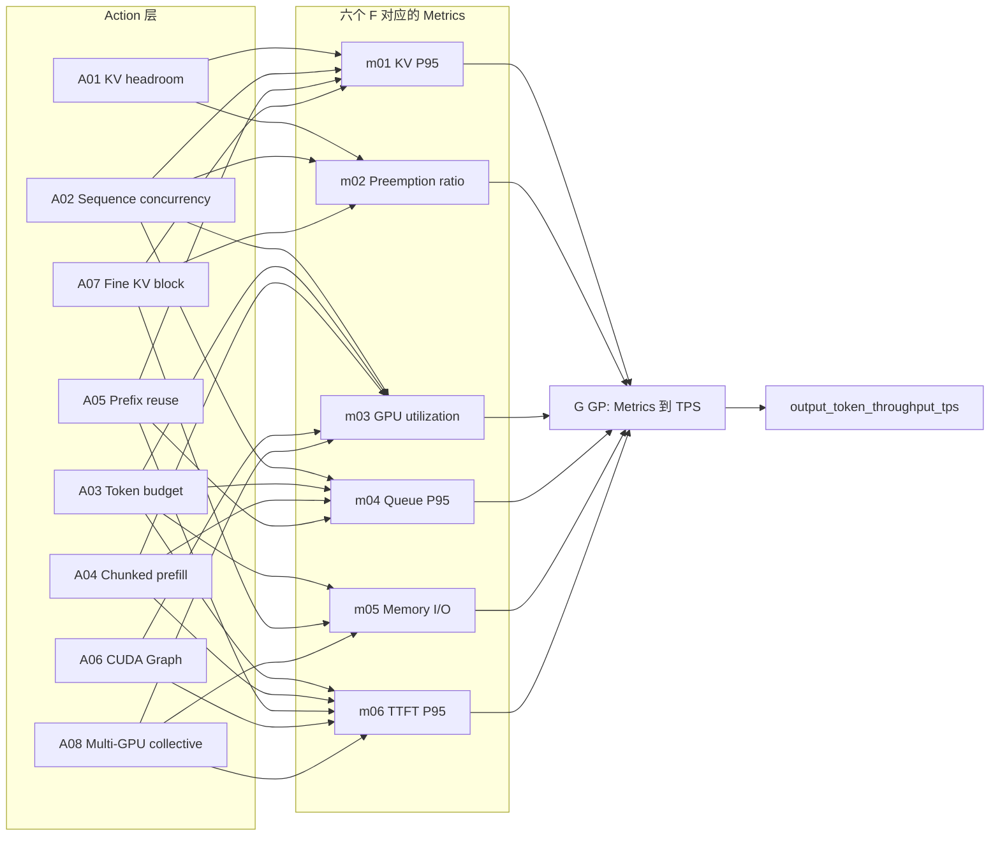

# DIBO v10 工程计划：env 机开发、环境重建与 CPU 测试门禁

> 更新日期：2026-09-08。

> 实施依据：[最新系统设计](DIBO_动态邻接Action贝叶斯调参方案_v8.md)与[修改问题及删减总结](DIBO_历次修改问题与冗余删减总结.md)。

> 本计划完整替换旧 PLAN，不保留失效的算法、配置、Schema 或历史实施章节。

> 本文只规划在联网 env 机上完成环境重建、编码和非 GPU 测试；当前阶段不配置 GPU 机、不启动 vLLM、不运行 GPU 实验。

> 算法结构仍以 v8 为准；v10 删除共享文件系统下多余的离线传输与 GPU 机装环境步骤，并把 Day 1–14 全部限定为 env 机可完成的代码任务。

## 1. 修正检查与最终边界

### 1.1 旧问题逐项处理

| 修改总结中的问题 | 本计划的处理 | 主要落点 |
|---|---|---|
| G 职责写错 | G 是六个 Metrics 到 TPS 的 GP；硬阈值判断属于 Selector | 第 10–11 节 |
| 增加 H 或额外局部 GP | 只训练六个 F GP 和一个 G GP，不为每轮损失另训模型 | 第 10、12 节 |
| 固定选择两个 Action | 先选 1–3 个 Metrics，默认 2 个；Action 集取全部邻接并集 | 第 6、11 节 |
| BO 目标偏向直接吞吐 | 主目标是选中 Metric 的阈值或反事实点目标距离；G 仅辅助 | 第 11–12 节 |
| 基准配置与增量不清 | 初始实验用 x_init，初始最佳实测配置成为唯一 x_base | 第 7–9 节 |
| 未选 Action 仍参与 | 八维系数完整保存，集合外严格为 0.0 | 第 8 节 |
| Mask 与冻结状态过多 | 所有 15 参数、8 Actions 始终存在，只有候选合法性检查 | 第 4–6、8 节 |
| 把无效参数永久排除 | 对当前候选检查支持并保存有效性证据，不维护永久排除状态 | 第 8、14 节 |
| 分类参数加法混乱 | 带符号投票、0.35 死区、有序相邻移动 | 第 8 节 |
| 整数转换不确定 | 所有贡献先求和，裁剪、HALF_UP，再做必要网格对齐 | 第 8 节 |
| 稀疏向量缺少方向先验 | 完整保留 8×15 稠密矩阵、锚点与赋值说明 | 第 5、16 节 |
| LLM 更新时机不合适 | 默认每 3 次 BO 尝试结束 review，下一轮才生效 | 第 13、15 节 |
| 更新后历史 z 含义漂移 | F 仍用邻接 z；旧 W 样本使用 2 倍噪声，实际配置增量只作证据 | 第 9–10 节 |
| Metric 冗余 | 六个中间节点和唯一 TPS 输出；TPOT 不设模型节点 | 第 6、14 节 |
| 图、矩阵、模型混淆 | 图决定选谁，矩阵决定怎么改，F/G 学习实测关系 | 第 5–6、10 节 |
| 分布式与恢复设计过重 | 共享目录直接保存代码和数据；无文件传输、租约、自动选主、断点恢复、故障注入 | 第 2、14–15 节 |
| 独立预算及提案状态过重 | Controller 一个尝试计数器；更新只有 keep/modify 和下一轮版本 | 第 7、13、15 节 |
| 模块、测试与工期过大 | 14 个明确代码模块、4 组接口、1 类 CPU E2E、14 天逐日门禁 | 第 17–20 节 |

### 1.2 核心闭环

下图描述最终算法逻辑；Day 1–14 使用 FakeTrialRunner 和 synthetic 数据走通同一控制流，不执行真实 GPU Trial。

```text

解析 x_init、15 参数、8 Action 矩阵与 8×6 图

→ 执行 5–10 次初始实验（默认 10 次）

→ 从成功初始实验中选最高 TPS 的真实配置为固定 x_base

→ 保存历史 z/W 版本，并把最终配置相对 x_base 编码为执行证据

→ 用邻接 z 拟合六个 F，用实测 Metrics/TPS 拟合一个 G

→ 硬阈值优先选择 Metrics；无越界时用 G 搜索反事实目标 m*

→ 取得选中 Metrics 的全部邻接 Action 并集

→ 只在该并集中搜索，集合外八维系数补为 0.0

→ 用 F 后验驱动 Metric Loss 的贝叶斯优化

→ 从固定 x_base 编译并执行真实候选

→ 每次追加结果并更新 F/G

→ 小轮次结束后 LLM 微调下一轮 W

→ 达到总次数限制后输出最佳记录；真实 GPU 结果留待后续阶段

```

### 1.3 明确不实现

- H 层、直接 z→TPS 的代理模型、额外局部吞吐 GP。

- 固定 Top-2 Action 截断、按 F 梯度再删减邻接 Action。

- Action active/capability/workload mask、参数 tunable/永久冻结状态。

- 基于 Action 版本分组而丢弃可编码的历史训练数据。

- Docker、独立引擎容器、并行 Trial、多 worker 调度。

- BudgetLedger、租约、跨节点锁、自动恢复、断点重放、故障注入。

- 复杂提案审批生命周期、末段专用更新验证阶段、生产告警。

保留：基本超时、非法候选跳过、失败记录、完整配置、原子结果写入、只停止自身进程。

共享挂载目录让未来的 GPU 节点看到同一份代码和结果，因此不实现复制脚本或分布式同步。只保留 LLM 请求/响应所需的最小 JSON 文件往返协议，并在 env 机用临时目录测试。

“不冻结参数”不代表忽略 vLLM 的参数兼容性和硬件约束；这些约束现在使用纯函数和 fixture 测试。

## 2. 当前阶段的工作边界

### 2.1 唯一工作机器

本计划的 Day 1–14 全部在联网的 env 机上完成。env 机负责：

- 删除并重建项目的 `dibo` Conda 环境。
- 安装项目开发依赖。
- 编写全部业务代码、Schema、配置和测试。
- 运行 Ruff、单元测试、接口测试和 CPU 合成端到端测试。
- 使用 mock/fake 验证 vLLM 进程、Prometheus、NVML 和 LLM API 适配器。

GPU 机与 env 机使用同一挂载目录，因此不需要复制代码、下载 wheelhouse、构建离线安装包或在 GPU 机创建环境。本计划不登录 GPU 机、不安装 GPU 依赖、不加载模型，也不运行任何真实 GPU 测试。

### 2.2 当前代码执行关系

```text
env 机
  ├─ 配置与核心算法：Schema / Compiler / F-G / Selector / BO
  ├─ 执行适配器：Engine / Benchmark / Metrics（全部使用 fake 或 fixture 测试）
  ├─ 控制层：Trial / Controller / LLM Update / Report / CLI
  └─ 测试：Unit → Interface → CPU synthetic E2E
```

真实 vLLM 和 NVML 代码仍保留清晰接口与延迟导入，便于后续在 GPU 环境验证；本阶段的完成标准不包含真实推理性能、GPU 指标或吞吐提升。

### 2.3 明确删除的操作

- 不在 GPU 机删除或创建 Conda 环境。
- 不构建 `wheelhouse`、离线 wheel 清单或离线安装脚本。
- 不进行 `scp`、`rsync` 或共享目录同步程序开发。
- 不下载或复制模型与 tokenizer。
- 不执行 `CUDA_VISIBLE_DEVICES`、vLLM 启动或 NVML 实机采样。
- 不把 GPU 测试 skip 数量作为本阶段验收内容。

## 3. env 机环境重建与安装

### 3.1 环境原则

- 只处理 env 机上的精确环境名 `dibo`。
- 删除前使用 `conda env list` 确认环境存在，并确认没有项目进程正在使用。
- 只删除 `dibo`，不删除 base、其他环境或 Conda 目录。
- Python 固定为 3.10。
- 当前只安装 CPU 开发与测试依赖，不安装 `vllm`、CUDA、Torch GPU 包或 `nvidia-ml-py`。

本计划只给出 Day 1 的操作命令；本次文档更新本身不会删除或安装环境。

### 3.2 重建命令

在项目根目录执行：

```bash
conda env list
conda deactivate

# 仅当 conda env list 中存在精确名称 dibo 时执行
conda env remove -n dibo -y

conda create -n dibo python=3.10 pip -y
conda activate dibo

python -m pip install --upgrade pip setuptools wheel
python -m pip install -e ".[test]"
python -m pip check
python -c "import dibo, httpx, numpy, pydantic, yaml, scipy, sklearn, typer, pytest"
python -m ruff check src tests
python -m pytest -q tests/unit/test_package_smoke.py tests/unit/test_cli.py
```

如果旧环境不存在，直接创建新环境；不要把 `conda env remove` 的“环境不存在”当成项目失败。

### 3.3 pyproject.toml 的当前依赖

基础依赖：

```toml
[project]
requires-python = ">=3.10"
dependencies = [
  "httpx>=0.27",
  "numpy>=1.26",
  "pydantic>=2.7",
  "PyYAML>=6.0",
  "scipy>=1.11",
  "scikit-learn>=1.4",
  "typer>=0.12",
]

[project.optional-dependencies]
test = [
  "pytest>=8",
  "pytest-asyncio>=0.23",
  "ruff>=0.6",
]
gpu = [
  "nvidia-ml-py>=12",
  "vllm==0.11.2",
]
```

`gpu` extra 只记录未来真实运行所需依赖，本阶段禁止执行 `pip install -e ".[gpu]"`。业务模块不得在包导入时强制导入 vLLM、Torch 或 pynvml。

### 3.4 依赖职责

| 依赖 | 用途 |
| --- | --- |
| httpx | vLLM HTTP、健康检查、LLM API |
| numpy/scipy | Action、Sobol、数值和后验采样 |
| pydantic/PyYAML | Schema 与 YAML 配置 |
| scikit-learn | 六个 F GP 和一个 G GP |
| typer | `dibo` CLI |
| pytest/pytest-asyncio | 单元、接口和 E2E 测试 |
| ruff | 静态检查和格式检查 |
| nvidia-ml-py | 未来 GPU/NVML 指标；当前不安装，以 fake adapter 测试 |
| vllm==0.11.2 | 未来真实推理引擎；当前不安装，以 fake subprocess/HTTP 测试 |

首版不同时引入 GPyTorch/Botorch；先用 sklearn 完成闭环，避免两套 GP 实现。

## 4. 全部 15 参数及 x_init

### 4.1 固定顺序、范围与尺度

固定顺序为 p01–p15，任何矩阵、Trace、LLM 输出和编码均使用同一顺序。

以下是 v8 的初始化值和域，不沿用旧 PLAN 的 p03=64、p08=0 或旧范围。

| ID | 参数 | 类型 | x_init | 合法域 | 数值尺度 s_i / 分类方向 |
|---|---|---|---|---|---|
| p01 | tensor_parallel_size | ordered choice-int | MIN_FIT_TP | 1/2/4/8 中满足分配与模型约束者 | 更大相邻 TP |
| p02 | pipeline_parallel_size | ordered choice-int | 1 | 1/2/4 中满足分配与模型约束者 | 更大相邻 PP |
| p03 | max_num_seqs | int | 128 | [32,1024] | 64 |
| p04 | max_num_batched_tokens | int | PROMPT_P95_OR_8192 | [512,32768]，256 对齐 | 2048 |
| p05 | block_size | ordered choice-int | 16 | [8,16,32] 中当前 backend 支持者 | 更大相邻 block |
| p06 | gpu_memory_utilization | float | 0.90 | [0.70,0.98] | 0.04 |
| p07 | swap_space | float | 4.0 GiB/GPU | [0,16] | 2.0 GiB |
| p08 | cpu_offload_gb | float | 2.0 GiB/GPU | [0,16] | 2.0 GiB |
| p09 | max_num_partial_prefills | int | 2 | [1,8] | 2 |
| p10 | max_long_partial_prefills | int | 1 | [1,8] | 1 |
| p11 | long_prefill_token_threshold | int | PROMPT_P75 | [256,max_model_len]，256 对齐 | 1024 |
| p12 | enable_chunked_prefill | bool vote | true | false/true | 正票 true |
| p13 | enable_prefix_caching | bool vote | 按请求集初始化 | false/true | 正票 true |
| p14 | disable_custom_all_reduce | bool vote | false | false/true | 正票禁用 custom all-reduce |
| p15 | enforce_eager | bool vote | false | false/true | 正票强制 eager |

数值尺度是物理单位步幅，不是归一化参数值的步幅，也不是网格间距。

p06/p07/p08 不额外沿用旧版 0.01/0.5 网格，除非目标引擎确有要求并显式记录。

ordered choice 的全局顺序固定，当前候选合法值由同一约束函数计算。

### 4.2 初始化器的确定性解析

`MIN_FIT_TP`：从获配 GPU 支持的合法 TP 中选择可加载目标模型的最小值，PP 初始为 1。

评估使用模型结构、权重大小、dtype、实际显存、p06/p08 和必要运行余量，最终由 smoke 验证。

只获配单卡时 TP 合法候选至多为 [1]；放不下则报告不可行，不自动占其他卡。

`PROMPT_P95_OR_8192`：读取应用 chat template 后的真实 prompt token 长度，求 P95，对齐 256 后与 8192 取较大值，再裁剪到 p04 的合法网格。

`PROMPT_P75`：相同请求集的 P75 对齐 256，再裁剪到 [256,max_model_len] 内的合法网格。

默认 max_model_len=8192；若上界不是 256 的倍数，使用不超过它的最大合法网格点。

p13：请求集明确包含稳定共享前缀时 true，否则 false；建议请求准备时生成前缀 profile 元数据，不凭 Action 效果反推。

p08 按 v8 初始化为 2.0，不使用旧版 AUTO_MODEL_FIT；这可能有传输开销，后续由实验评估。

使用 NumPy 的明确分位数方法，例如 `method=linear`，并保存请求文件 hash、tokenizer revision 和解析值。

初始化器只有解析期可出现符号值；真实启动要求全 15 项为合法类型实值。

没有足够信息完成解析时停止并给出缺项，不能猜一个值冒充计算结果。

### 4.3 联合约束与当前环境支持

```text

p01 * p02 <= allocated_gpu_count

num_attention_heads % p01 == 0

num_hidden_layers % p02 == 0

p04 >= p03

1 <= p10 <= p09

256 <= p11 <= max_model_len

0.70 <= p06 <= 0.98

p03/p09/p10 为整数

p04/p11 对齐 256

block_size 与当前 backend 兼容

所有值满足类型、范围、模型、主机内存及版本约束

```

除以上规则外，查询当前版本对 chunked prefill、partial prefill、batched tokens/context 的实际限制。

不在 Compiler 中悄悄修复任意组合：无法满足条件的候选返回 constraint_errors。

不使用“关闭 chunked prefill 就自动把 p11 改成 0”的旧规则，这与 v8 的 p11 下界冲突。

一个参数不受当前版本支持时，记录参数名和原因并拒绝该候选；不能静默丢字段。

如果所有候选都因版本根本不支持某个必需字段而失败，应报告版本兼容阻塞，而不是永久冻结或删掉该参数。

引擎接受但当前场景无可证明作用的字段仍保留，按 Trial 记录 ineffective/unknown 证据，不据此修改 Action 集。

## 5. 八个 Action 与完整方向矩阵

### 5.1 语义和适用场景

每个 Action 系数 z_a∈[-1,1]，正方向不保证 TPS 增加，负方向也不代表有害。

场景描述用于解释先验，不产生运行时 Mask。

| ID | 名称 | 正方向 | 典型适用场景与代价 |
|---|---|---|---|
| A01 | KV headroom expansion | 扩大 KV 余量，降低过度并发与 token 压力 | 长上下文、高 KV、抢占多；offload/并行可能增成本 |
| A02 | sequence concurrency expansion | 增加序列并发和配套 token/KV 预算 | 队列积压、短中请求多、GPU 未吃满；可能加重尾延迟 |
| A03 | forward token-budget expansion | 增大每次 forward/scheduler iteration token 预算 | 吞吐优先、prefill 多；可能干扰 decode |
| A04 | chunked-prefill priority | 加强分块、增加总 partial 槽位、限制长 prompt 槽位 | 长短混合和队首阻塞；可能牺牲长 prefill 完成速度 |
| A05 | prefix-reuse expansion | 加强共享前缀 KV 复用 | system prompt/RAG/模板重复；无前缀时也不删除此 Action |
| A06 | CUDA Graph / launch efficiency | 倾向非 eager，降低 host/kernel launch 开销 | decode-heavy、短 kernel 多；capture 不兼容时负方向可有用 |
| A07 | fine KV-block granularity | 倾向小 block，降低碎片并细化复用粒度 | 短序列和长度差异大；更细管理也有成本 |
| A08 | multi-GPU collective efficiency | 扩大并行度并倾向 custom all-reduce | 多卡/大模型；单卡仍保留，TP/PP 由约束限制 |

A06 表示 host-launch-bound，不等同于 KV 容量、HBM 带宽、算力或跨卡通信瓶颈。

单卡 A08 仍可能通过稠密向量中的 p03/p04 等数值项改变配置，不可只因名称中有 multi-GPU 就排除。

没有前缀复用时 A05 也保留，其主项是否有用由运行证据说明。

### 5.2 完整 8×15 矩阵 W

行固定 A01–A08，列固定 p01–p15。下表与 v8 初始化逐项一致。

| Action | p01 | p02 | p03 | p04 | p05 | p06 | p07 | p08 | p09 | p10 | p11 | p12 | p13 | p14 | p15 |
|---|---:|---:|---:|---:|---:|---:|---:|---:|---:|---:|---:|---:|---:|---:|---:|
| A01 | +0.30 | +0.15 | -0.85 | -0.45 | -0.35 | +1.00 | +0.35 | +0.30 | -0.25 | -0.20 | -0.15 | +0.30 | +0.10 | -0.05 | +0.15 |
| A02 | +0.15 | -0.20 | +1.00 | +0.85 | +0.15 | +0.45 | +0.10 | -0.25 | +0.35 | +0.20 | +0.10 | +0.40 | +0.20 | -0.10 | -0.35 |
| A03 | +0.15 | -0.10 | +0.30 | +1.00 | +0.10 | +0.25 | +0.05 | -0.20 | +0.35 | +0.25 | +0.30 | +0.70 | +0.05 | -0.10 | -0.25 |
| A04 | +0.05 | +0.10 | +0.15 | -0.55 | -0.10 | +0.15 | +0.05 | -0.05 | +0.85 | -0.70 | -0.65 | +1.00 | +0.10 | -0.05 | -0.15 |
| A05 | -0.05 | -0.03 | +0.25 | +0.20 | -0.30 | +0.40 | +0.05 | -0.05 | +0.10 | +0.05 | -0.10 | +0.15 | +1.00 | -0.03 | -0.10 |
| A06 | -0.10 | -0.10 | +0.30 | +0.20 | +0.05 | -0.20 | -0.05 | -0.10 | +0.10 | +0.05 | +0.05 | +0.15 | +0.05 | -0.10 | -1.00 |
| A07 | +0.05 | +0.05 | +0.35 | +0.15 | -1.00 | +0.30 | +0.10 | +0.05 | +0.10 | +0.05 | -0.05 | +0.10 | +0.30 | -0.03 | -0.05 |
| A08 | +1.00 | +0.45 | +0.20 | +0.35 | +0.05 | +0.25 | +0.10 | -0.25 | +0.10 | +0.05 | +0.05 | +0.15 | +0.05 | -1.00 | -0.30 |

这些值是 LLM 的机制先验，不是文献直接测得的回归系数，0.10 不表示性能变化 10%。

主项大、协同项小、弱先验非零，不会因此给 Action–Metric 图添加边。

### 5.3 锚点与赋值依据

| Action | 锚点 | 主要协同解释 |
|---|---|---|
| A01 | p06=+1.00 | p03=-0.85/p04=-0.45 降低需求，p05=-0.35 减碎片；p07/p08 提供成本较高的 CPU 余量；p15 弱正票考虑 capture 显存 |
| A02 | p03=+1.00 | p04=+0.85 与 p06=+0.45 支撑并发；partial 与 chunking 协同；p08/p15 负向抑制传输和 launch 成本 |
| A03 | p04=+1.00 | p12=+0.70 支撑混排；p03/p09/p10/p11 为预算提供工作量；p08/p15 负向减少执行成本 |
| A04 | p12=+1.00 | p09=+0.85 增总槽，p10=-0.70 限长槽，p11=-0.65 提早识别长请求，p04=-0.55 减小 chunk |
| A05 | p13=+1.00 | p06=+0.40 留 KV，p05=-0.30 细化复用；p03/p04 温和扩张，p01/p02/p08 弱负方向避免多余成本 |
| A06 | p15=-1.00 | 负票意味着允许 Graph；p03/p04 温和增工作量，p06=-0.20 留 capture 空间，p07/p08 弱负项减少 host 路径 |
| A07 | p05=-1.00 | 负票移向更小 block；p03/p06 可利用节省空间，p13=+0.30 支持完整块前缀命中，其他为弱协同 |
| A08 | p01=+1.00、p14=-1.00 | TP 为主、PP 次之；p03/p04 扩批摊薄 collective，p08=-0.25 优先 GPU 分工而非 CPU offload |

普通更新遵循 v8：锚点可在 [0.80,1.00] 的绝对值范围内微调，但不能翻转符号。

不再把所有锚点永久锁死为 1.00；单次变化上限和非锚点下限见第 13 节。

## 6. 六个 Metrics、邻接矩阵与完整图

### 6.1 指标及唯一输出

| ID | 字段名 | 来源 | 单位与聚合 |
|---|---|---|---|
| m01 | kv_cache_usage_p95 | vLLM Prometheus | ratio，正式窗口样本 P95 |
| m02 | preemption_rate | vLLM counter + benchmark | 窗口抢占增量/正式完成请求数 |
| m03 | gpu_utilization_mean | 获配 UUID 的 NVML GPU utilization | ratio，窗口均值 |
| m04 | queue_length_p95 | vLLM waiting requests | requests，窗口 P95 |
| m05 | gpu_memory_io_utilization_mean | 获配 UUID 的 NVML memory utilization | ratio，窗口均值 |
| m06 | ttft_p95 | benchmark 逐请求记录 | seconds，请求 P95 |
| y | output_token_throughput_tps | benchmark | 实际输出 tokens/正式测量秒数 |

m02 遵循 v8，不沿用早期 events/s；抢占次数可能大于请求数，所以该比值不必小于 1。

完成请求数为零或 counter reset 时 m02 不可用，不填零。

m05 是采样区间内 memory I/O 活跃度代理，不是 memory.used/MiB，也不是精确 HBM 带宽占比。

m03 高不一定好、m05 高不一定坏，它们不使用单向硬异常规则。

TPOT 可存在于官方原始输出中，但不作为节点、目标或 F/G 训练列。

### 6.2 8×6 邻接矩阵

| Action | m01 | m02 | m03 | m04 | m05 | m06 |
|---|---:|---:|---:|---:|---:|---:|
| A01 | 1 | 1 | 0 | 0 | 0 | 0 |
| A02 | 1 | 1 | 1 | 1 | 0 | 0 |
| A03 | 0 | 0 | 1 | 1 | 1 | 1 |
| A04 | 0 | 0 | 1 | 1 | 0 | 1 |
| A05 | 1 | 0 | 0 | 1 | 0 | 1 |
| A06 | 0 | 0 | 1 | 0 | 0 | 1 |
| A07 | 1 | 1 | 0 | 0 | 1 | 0 |
| A08 | 0 | 0 | 1 | 0 | 1 | 1 |

1 表示初始主要关系，0 表示不沿该边取得 Action；总共 24 条 Action–Metric 边。

### 6.3 每个 Metric 的完整邻接集

| Metric | N(m) | 数量 |
|---|---|---:|
| m01 | A01、A02、A05、A07 | 4 |
| m02 | A01、A02、A07 | 3 |
| m03 | A02、A03、A04、A06、A08 | 5 |
| m04 | A02、A03、A04、A05 | 4 |
| m05 | A03、A07、A08 | 3 |
| m06 | A03、A04、A05、A06、A08 | 5 |

$$

A^*=\bigcup_{m_k\in M^*}N(m_k).

$$

并集去重后严格按 A01–A08 排序，不按模型分数再截断。

m01+m02 → A01/A02/A05/A07，4 维；m03+m06 → A02/A03/A04/A05/A06/A08，6 维。

m01+m03+m06 → 全部 8 个 Action，允许完整 8 维搜索。

当前真实图非空邻接并集至少 3 维；优化器 API 应支持 1–8 维，1/2 维用合成图测试，不伪称实际图必然产生这些维度。

### 6.4 完整关系图



图是主要关系先验，不是因果证明；LLM 不修改图或邻接顺序。

## 7. 初始实验、固定基础样本与总次数

### 7.1 初始设计

正式默认 initial_trials=10，允许 5–10。

| 序号 | 系数 | 编译基础 | 目的 |
|---|---|---|---|
| 1 | 八维全零 | x_init | 原始基线 |
| 2–9 | A01–A08 依次单独 +0.8，其余 0 | x_init | 八个语义方向的基础响应 |
| 10 | 固定 seed 的 Sobol 混合点 | x_init | 联合与负方向覆盖 |

5–9 次模式保留零向量，其余采用 Sobol/maximin，报告覆盖限制。

非法或重复候选在 CPU 编译时替换为后续 Sobol 点，不删除产生该点的 Action。

重复判断只依据编译后的最终 15 维配置及固定模型/workload 上下文，不依据 z；同一配置有多个候选 z 时，按候选生成序号、再按 A01–A08 系数字典序选择确定性代表 z。

分类锚点在 +0.8 probe 下没有切换不算错误，如实记录总票和最终值；初始化不要求每个 Action 同时覆盖正负方向。

候选替换有上限，耗尽则结束并报告原因，不能无限循环凑满次数。

初始矩阵使用本文完整 W1；不在取得实测前再调用 LLM 无条件改掉已批准的初始化。

初始阶段一次 Runner 失败占一次尝试，不自动重跑该配置；当前由 FakeTrialRunner 覆盖此逻辑。

### 7.2 唯一 x_base

从初始已完成且满足请求成功率要求、TPS 有限的 Trial 中选：

$$

t_{base}=\arg\max_{t\in D_{init}^{success}}TPS(t).

$$

TPS 相等时 TTFT 较小者优先；仍相等按 trial_id 稳定排序。

无成功初始样本则结束，不能使用失败配置或 GP 预测值作为基础。

```text

base_trial_id

x_base：该 Trial 最终实际配置的全 15 个字段

base_metrics：六项观测及可用性

base_throughput_tps

base_config_hash

```

x_base 只选一次；之后即使出现更高 TPS，更新“当前最佳参考样本”，不移动 x_base。

如果基础样本存在缺失的内部 Metric，仍可保存它；缺失只影响 F/G 筛选，不编造观测。

初始原始 Trace 继续指向 x_init；选定 x_base 后统一派生实际参数增量供追踪、去重、复现和 LLM 分析，F 仍使用各 Trial 保存的邻接 z，见第 9–10 节。

### 7.3 小轮次和计数

算法默认预算为 10 次初始化 + 4 小轮×3 次 BO = 22 次 Runner 尝试；当前全部由 CPU FakeTrialRunner 执行。

一个小轮内固定 W、M*、A*、目标和权重；每次成功结果后可以更新 F/G 后验。

每轮结束才 review，合法修改在下一小轮生效；最后一轮修改仅存为下一次研究材料，不额外增加一次试验。

Controller 使用 attempted_trials 整数，启动失败、压测失败、超时都计数；Compiler 在调用 Runner 前拒绝的候选不计数。

调用 Runner 前检查 attempted_trials\<max_total_trials，并在调用前递增，失败只写一次记录。

max_total_trials 可小于 10+4×3，循环按剩余预算截断，不能超限。

CPU E2E 使用固定 seed 完整跑 22 次逻辑尝试；不得加入 sleep 模拟真实实验时长。

真实 Trial 耗时、GPU 分配时段和 pilot 预算不属于本阶段计划，后续实机验证时另行确定。

## 8. 相对基础配置的确定性编译

### 8.1 输入与完整 z

compile_config 接收 base_config、当前 ActionBundle、selected_actions、coefficients 和当前环境约束。

初始阶段 base_config=x_init；优化阶段只允许 base_config=x_base。

检查 selected_actions 是合法 Action 集且无重复。

BO 只创建 A* 中的变量；Compiler 将集合外无条件置为精确 0.0，并记录异常的非零请求输入以定位调用错误。

原始 requested_coefficients 和用于编译的八维 coefficients 分开，真实计算只使用后者。

拒绝未知 ID、NaN/Infinity、越界系数，缺省系数补 0.0。

### 8.2 数值与整数

$$

r_i=x_{base,i}+s_i\sum_{a\in A^*}z_aW_{a,i}.

$$

初始阶段公式中的 x_base 替换为 x_init，其余相同。

采用 v8 第 7.2 节的明确顺序，消除修改总结中口头描述的先后歧义：

1. 所有 Action 的连续贡献求和，不能逐 Action 取整。

2. 加到基础值后裁剪到该数值域。

3. 对整数用 Decimal ROUND_HALF_UP 一次性整数化。

4. p04/p11 再按 256 的网格用 HALF_UP 对齐，取范围内合法网格。

5. 执行全部联合约束，错误返回 Trace，不继续启动。

基础值本身必须是合法网格点，零向量应恢复基础配置。

浮点按精确十进制输入求和或规范序列化，避免不同字符串精度造成虚假 hash 差异。

参数尺度 s_i 不由 LLM 更新，p04/p11 的 256 网格也不等于其 2048/1024 Action 尺度。

### 8.3 有符号分类投票

bool p12–p15 的基础票由当前编译基础值派生：true 为 +0.35，false 为 -0.35。

ordered choice p01/p02/p05 的基础票均为 0，以基础配置的值为 anchor。

不再沿用旧 p02=-0.35 的初始化偏置，x_base 改选后也不沿用 x_init 的 bool 票。

$$

v_i=b_i+\sum_{a\in A^*}z_aW_{a,i},\qquad\tau=0.35.

$$

| 判定 | bool | ordered choice |
|---|---|---|
| v_i>+0.35 | true | 从基础 anchor 向上相邻合法值一步 |
| v_i<-0.35 | false | 从基础 anchor 向下相邻合法值一步 |
| -0.35≤v_i≤+0.35 | 保持基础值 | 保持基础 anchor |

等于任一边界都保持，不存在“等于 margin 时选赢家”的旧规则。

相邻列表来自当前环境约束；到达边界则保持并记录 at_boundary。

TP/PP 先得到各自候选，再做联合检查；组合非法时拒绝，不偷偷多步修复。

每次从固定 anchor 出发，不能从上一 Trial 的枚举值继续移动。

单卡时 TP/PP 可能只有 1，但字段、对应矩阵项和 A08 均保留。

p14 在单卡是否实际生效由引擎证据记录，不增加 Action mask，也不把无证据的“有效”写入结果。

### 8.4 编译手算样例

假定基础 p03=128、p04=8192、p05=16、p15=false，单独 A06=+0.8：

```text

p03 raw = 128 + 64 * 0.8 * 0.30 = 143.36 → 143

p04 raw = 8192 + 2048 * 0.8 * 0.20 = 8519.68 → 8520 → 8448

p15 vote = -0.35 + 0.8 * (-1.00) = -1.15 → false

```

单独 A06=-0.8 时 p15 vote=-0.35+0.8=+0.45 → true。

单独 A07=+0.8 时 p05 vote=-0.8，若合法候选为 [8,16,32] 则从 16 移到 8。

W 稠密意味着其余数值也须同时编译；以上只展示局部值，不能省略其他 12 项。

### 8.5 全部 15 项与实际有效性

Trace 保存最终全 15 参数，命令生成器只消费该最终对象，不二次取整或投票。

每项附本 Trial 的 emitted flag、引擎确认来源、effect_observation=confirmed|ineffective|unknown。

这些是结果证据，不是永久的启用/冻结状态，不参与 A* 筛选。

若引擎实际解析的值与 Trace 不同，记录不一致并拒绝把该点作为可靠训练样本，不能篡改原 Trace 掩盖问题。

配置 hash 基于全 15 最终值及固定模型/workload 上下文，不包含端口、PID、日志路径或 Action 版本。

不同 W/z 生成同配置时视为候选重复；尚未执行时只保留第 7.1 节定义的确定性代表 z，不靠不同 Action 版本重复消耗 GPU。

若重复配置已因真实执行、重试或外部导入而存在，原始记录不得删除，可用于估计观测噪声，但不增加 unique_config 计数。

## 9. CompileTrace、实际参数增量与历史兼容

### 9.1 必需记录

```yaml

schema_version: 8

trial_id: trial_012

phase: bo

bo_round: 1

action_version: 1

compile_base_id: trial_007

base_trial_id: trial_007

selected_metrics: [m01, m02]

selected_actions: [A01, A02, A05, A07]

coefficients: {A01: 0.4, A02: -0.2, A03: 0.0, A04: 0.0, A05: 0.65, A06: 0.0, A07: 0.1, A08: 0.0}

numeric_decisions: {}

categorical_decisions: {}

final_config: {}

effective_parameter_delta: {}

constraint_errors: []

config_hash: EXAMPLE_ONLY

```

这是字段形状示例，真实 Trace 的 final_config 必须恰好 15 项，decisions 必须完整，不能使用空字典占位。

numeric_decisions 含基础值、每 Action 贡献、连续和、裁剪、整数化、网格对齐和最终值。

categorical_decisions 含基础值、基础票、各 Action 票、总票、阈值、合法候选、anchor 与最终值。

initial Trace 的 compile_base_id=x_init，尚未选 base 时 base_trial_id 可空。

selected_metrics 初始为空，selected_actions 可为全部 8 个，八维 z 中仍只有设计点非零。

valid 从 constraint_errors 是否为空派生，不能维护两个互相矛盾的字段。

### 9.2 实际参数增量 phi 的定义与用途

只从最终实际配置 x 和固定 x_base 生成 15 维实际参数增量，不从当前 W 反推旧 z。

$$

\phi_i(x,x_{base})=\begin{cases}

(x_i-x_{base,i})/s_i & \text{float/int},\\\\

index_i(x_i)-index_i(x_{base,i}) & \text{ordered choice},\\\\

int(x_i)-int(x_{base,i}) & \text{bool}.

\end{cases}

$$

数值归一化使用第 4 节已指定的固定物理尺度 s_i。

枚举编码索引使用参数定义的固定有序全集，不因某轮候选是否合法临时重编号。

bool 编码为 -1/0/+1；这是已执行配置的证据，不是让 bool 参与配置加法。

effective_parameter_delta 保存真实数值差、枚举索引差与 bool 差，并注明基础 ID 和 encoder_version。

编码不裁剪回 [-1,1]：初始配置相对 x_base 的差异可能超过一倍尺度。

phi 不作为 F 的训练或预测输入。它只用于记录真正执行的 vLLM 配置、按最终 15 维配置去重、复现实验、检查分类投票/取整/裁剪结果，以及向 LLM 解释 Action 实际造成的参数变化。

系统中的变量职责固定为：BO 与 F 使用 Action 系数 z；Compiler 使用 W 和 z 生成 x；Trace、去重、复现与 LLM 使用 x 和 phi。

### 9.3 初始样本换基准

初始 Trial 都实际从 x_init 运行，原始 spec/Trace 不变。

选定 x_base 后，从每条 initial 的 final_config 重新计算相对 x_base 的派生编码和 effective_parameter_delta。

派生记录写 base_trial_id/encoder_version，既能追溯最初执行基础，也能加入后续统一训练。

不能把相对 x_init 的特征与相对 x_base 的特征直接拼接。

后续 x_base 不变，W 更新只影响新候选配置，不改变旧样本保存的 phi。

### 9.4 训练兼容边界

同一最终配置与 x_base，无论 action_version/z 如何，phi 必须一致。

相同 z 在新 W 下若配置改变，phi 必须改变，但 F 的输入仍为保存的邻接 z 子向量。

本次 run 内所有兼容成功历史可跨 Action 版本训练 F，不按 representation_id 隔离，也不把输入切换回 phi。

不同模型、请求集、硬件分配、编码尺度或 x_base 的实验不混训。

Action 版本用于解释、重放和设置样本噪声，不增加为 F 的输入维度，也不作为直接丢弃历史的理由。

旧配置缺字段或与实际执行不符时报告不可编码，不用填零伪造完整配置。

## 10. 六个 F GP 与一个 G GP

### 10.1 模型和图的边界

```text

F01 的动作关系：A01,A02,A05,A07 → m01

F02 的动作关系：A01,A02,A07 → m02

F03 的动作关系：A02,A03,A04,A06,A08 → m03

F04 的动作关系：A02,A03,A04,A05 → m04

F05 的动作关系：A03,A07,A08 → m05

F06 的动作关系：A03,A04,A05,A06,A08 → m06

G 的输入：m01,m02,m03,m04,m05,m06 → TPS

```

每个 F 只读取对应 Metric 的邻接 Action 系数，固定输入顺序如下：

$$

F_k:z_{N(m_k)}\rightarrow m_k.

$$

| F | Metric | 固定输入 Action 顺序 | 输入维度 |
|---|---|---|---:|
| F01 | m01 | A01,A02,A05,A07 | 4 |
| F02 | m02 | A01,A02,A07 | 3 |
| F03 | m03 | A02,A03,A04,A06,A08 | 5 |
| F04 | m04 | A02,A03,A04,A05 | 4 |
| F05 | m05 | A03,A07,A08 | 3 |
| F06 | m06 | A03,A04,A05,A06,A08 | 5 |

图同时决定两件事：所选 Metrics 的全部邻接 Action 并集进入本轮 BO；每个 F 只从完整八维 z 中按自己的固定邻接顺序取列。

例如本轮同时选择 m01 与 m03 时，BO 搜索两者邻接并集，F01 只读取 z[A01,A02,A05,A07]，F03 只读取 z[A02,A03,A04,A06,A08]。

所有 F 观测都来自同一个真实联合配置的本次执行结果，但不把该配置的 15 维 phi 作为模型输入，也不为每个 F 单独编译局部配置。

图是建模先验；未画边的稠密交叉影响归入模型噪声和研究限制，不临时扩展 F 输入列。

### 10.2 F 训练数据

每个 F 取 status=success、请求成功率合格、最终配置可编码且对应 m_k 有限的 Trial。

某个 Metric 缺失只从该 F 删除该行，不删除其他 F 的有效观测。

每行保存 trial_id、action_version、compile_base_id、完整八维 z、final_config_hash 和 effective_parameter_delta，便于查证。

F_k 的训练输入 shape=[n_k,|N(m_k)|]，输出 shape=[n_k]；训练和预测都必须保存并校验 action_feature_order，禁止列顺序变化。

当前 W 版本样本使用正常观测噪声；历史 W 版本样本首版使用 2 倍观测噪声，以表达相同 z 在不同 W 下可能产生不同配置。

不同 Action 版本不拆组，不直接删除旧实验。已真实执行的重复配置保留为重复测量以估计噪声，但 min_unique_configs 和有效样本量不能把它们误算成新的独立配置。

可选高级策略才使用 noise_t=noise_0+lambda*||W_t-W_current||_F^2；首版不实现矩阵距离函数。

### 10.3 GP 实现约定

使用现成 GP 库，首版 Matérn 5/2 + ARD，输出标准化仅在训练样本拟合。

加正的噪声/jitter，采用有界优化次数、固定 seed、float64 和有限 CPU 线程。

建议工程起点 min_train_samples=5、min_unique_configs=3，五点小闭环才可能有初步后验。

这只是数值可拟合门槛，不是统计可靠性保证；10 初始点的模型也可能很不稳定。

样本不足、非有限输入、拟合失败或接近常量输出返回 not_ready/unstable 和原因。

不稳定的所选 F 不能产生伪 acquisition，候选在同一个 A* 空间改走 Sobol。

```text

posterior_mean / posterior_variance

training_trial_ids / n_samples / n_unique_configs

fit_status / failure_reason

action_feature_order / output_unit / scaler

action_neighbors / action_version_noise_policy / base_trial_id

```

### 10.4 G 的训练与职责

G 输入是实测六维 Metric，输出实测 TPS。

只使用六项完整、有限、请求成功率合格、TPS 有效的成功 Trial。

不把缺失 Metric 填成 0，不用 F 插补来伪装实测完整训练样本。

输入和输出 scaler 只 fit 当前训练集，保存特征顺序与反变换单位。

W 更新不改变历史实测 m/TPS，因此直接使用跨版本成功历史。

G 只负责无硬阈值问题时的反事实 Metric 目标、重要性以及候选次级比较。

G 不直接输出 z，也不替代 F 的 Metric Loss acquisition。

## 11. 每小轮的 Metric 选择

### 11.1 参考样本和阈值

从全部成功历史取当前最高实测 TPS 的 Trial 为 reference，平局规则同选基础。

reference 可以变化，x_base 不变。

默认 metric_top_k=2，允许 1–3；第三项需满足比例规则。

metric_top_k 是基础选择数，metric_top_k_max 是硬上限：默认 2/3 时先取至多两项，第三项仅在满足 80% 规则时加入。

metric_top_k=1 时只取一项；metric_top_k_max=2 时禁止扩到三项；设为 3 也不能绕过第三项比例条件。

配置校验要求 1≤metric_top_k_min≤metric_top_k≤metric_top_k_max≤3，实际可用项不足时不凑数。

| Metric | trigger 起点 | normal target 起点 | scale |
|---|---:|---:|---:|
| m01 | 0.90 | upper 0.85 | 0.05 |
| m02 | 0.02 | upper 0.01 | 0.01 |
| m04 | pilot 后指定 | pilot 后指定的 upper | pilot 后指定正数 |
| m06 | workload.ttft_slo_s | 相同 upper | 0.10 seconds |

ttft_slo_s=1.0 仅是 v8 配置示例中的实验目标，不是已知业务 SLO，正式前确认。

m04 的占位符不能进入真实正式运行；只对合成测试使用显式人工测试数值。

m03/m05 不设固定“越高越坏”规则，正常参考来自高吞吐历史。

### 11.2 硬阈值优先

对有定义、当前可用的 m01/m02/m04/m06，以 m_k≥trigger_k 判断越界。

严重度采用：

$$

severity_k=\max\left(0,\frac{m_k-trigger_k}{scale_k+\epsilon}\right).

$$

默认取严重度最高的两个，只有一个越界就只选一个，不补入非异常指标凑二。

允许第三项时，第三名需不低于第二名的 80%，且具有正严重度；metric_top_k=1 时不额外扩到三项。

完全相同分数按 metric_id 稳定排序。

恰好等于 trigger 时判为越界但 severity=0，不能因此得到空集或除零。

选择全部为零分时等权；混有正分时给已选项一个明确的小正下限再归一化，并记录实际权重。

硬阈值分支不因 G 尚未就绪而失效。

### 11.3 无明显越界时使用 G

只在没有可用的越界项时计算 G 的反事实重要性。

对每个 Metric，从 G 可训练的完整成功历史构造可信范围 R_k：至少 5 个唯一值时使用观测 Q05–Q95，否则使用观测 min–max，并与该 Metric 的物理合法域取交集。

少于 2 个唯一值、范围为空或 G 未就绪时，该 Metric 不产生反事实目标。

在 R_k 的固定网格与已观测值并集上，只替换 reference 的第 k 个 Metric，其余五项保持不变，搜索保守最优目标：

$$

m_k^*=\arg\max_{v\in R_k}\left[\mu_G(m_{-k},v)-\beta\sigma_G(m_{-k},v)\right].

$$

记 LCB_k(v)=mu_G(m_-k,v)-beta*sigma_G(m_-k,v)，以 reference 的 G 后验均值作为保守候选必须超过的基线：

$$

importance_k=\max\left(0,LCB_k(m_k^*)-\mu_G(m_{reference})\right).

$$

首版 beta=1.0、每维反事实网格 64 点；相同 LCB 时优先离 reference 当前值更近者，再按数值稳定排序。

用同一 G 的 scaler和输出反变换计算 TPS 差，不能比较不同单位的差分。

选择正重要性最大的默认两项，第三项规则与 80% 一致；所有值近零转探索。

所选 Metric 的本轮目标就是对应点目标 m_k^*，F-BO 最小化到该点的归一化距离，不再使用高吞吐 top25% 的 P25–P75 区间。

G 反事实是模型敏感性，不宣称已经识别因果瓶颈。

反事实点可能偏离真实联合分布，保存 R_k、替换前后值、mu/sigma/LCB、beta 和 importance，在报告中说明局限。

### 11.4 不完整数据与探索

reference 有缺失 Metric 时，对可用指标先查硬阈值；G 反事实需要完整 reference，缺失则进入探索而非填值。

G not_ready 或全部 importance 近零时，选择归一化预测不确定性最大的可用 F 对应 Metric。

比较不确定性时使用训练输出尺度，避免秒数和队列长度的数值量级影响排名。

若 F 也不可靠，用固定 seed 的 Metric 轮转作为最后后备，仍由图取得全部邻接并集。

没有足够数据给正常目标时标记 target_unavailable，仅做同一 A* 下的 Sobol，不声称执行了基于 Loss 的 BO。

硬阈值仍成立但 F 不可靠时，保留 selected_metrics，优化器只回退选点方式。

### 11.5 小轮固定输出

```yaml

reference_trial_id: trial_010

mode: hard_threshold

selected_metrics: [m01, m02]

scores: {m01: 0.8, m02: 0.6}

weights: {m01: 0.5714285714, m02: 0.4285714286}

targets:

  m01: {kind: upper, value: 0.85, scale: 0.05}

  m02: {kind: upper, value: 0.01, scale: 0.01}

selected_actions: [A01, A02, A05, A07]

bo_dimension: 4

```

以上数值为结构示例，不是已有真实运行结果。

M*、A*、权重和本轮目标在小轮三次内固定，下一轮基于新历史重新计算。

否则同一轮的 acquisition 改善基准会随试验变化而无法解释。

## 12. 动态维度 Metric-Loss 贝叶斯优化

### 12.1 正常距离

上界、下界、区间和 G 反事实点目标的距离分别为：

$$

d^{upper}_k(m)=\max(0,(m-T_k)/scale_k),

$$

$$

d^{lower}_k(m)=\max(0,(T_k-m)/scale_k),

$$

$$

d^{interval}_k(m)=distance(m,[L_k,U_k])/scale_k.

$$

$$

d^{point}_k(m)=|m-m_k^*|/scale_k.

$$

scale_k 必须正且有限；G 点目标优先使用可信范围的 IQR，IQR 为零时使用 max((max(R_k)-min(R_k))/2,epsilon)，并保存实际 scale。

选中目标在每轮开始时固定，不能让 LLM 修改。

Loss 使用真实单位的 F 反标准化后验，不能将 scaler 后的均值直接代入真实目标。

$$

Loss(z)=\sum_{k\in M^*}\alpha_kd_k(F_k(z)),\qquad\sum\alpha_k=1.

$$

硬阈值分支 alpha 来自 severity；G 分支来自 importance；零分探索有目标时使用等权。

### 12.2 后验 acquisition，不另训损失模型

利用六个已有 F 的预测后验，针对所选 Metric 采样，计算 Loss 的 Monte Carlo 分布。

初始建议 mc_samples=128，固定采样 seed；独立单输出 GP 下暂按跨 Metric 后验独立近似。

指标物理范围限制与后验正态近似的处理要一致，例如非负量/ratio 的样本投影，并在记录中注明。

从历史中拥有本轮所选全部 Metric 的成功样本重算当前目标下的最小实测 L_best。

$$

EI(z)=\mathbb E\left[\max(0,L_{best}-Loss(z))\right].

$$

等价于最大化 -Loss 的期望改进，不使用 H 或“本轮目标局部 GP”。

不能以 d_k(E[F_k]) 代替 E[d_k(F_k)]，否则会遗漏非线性距离和不确定性。

没有有效 incumbent 或所选 F 未就绪时，回退同一 A* 下的 Sobol。

L_best=0 时非负 Loss 的 EI 可全部为零；使用同一 A* 中归一化 F 方差高的合法候选探索，不偷偷转成直接 TPS 优化。

### 12.3 候选池

1. 以固定小轮 A* 的维度生成 2048 个 Sobol/随机候选。

2. 补齐八维 z，集合外精确 0.0。

3. 当前 W 和固定 x_base 编译全 15 参数。

4. 去除非法、与已执行历史重复及池内重复的最终配置。

5. 各 F 按固定 action_feature_order 读取同一候选的邻接 z 子向量，计算后验、预期 Loss、EI。

6. 先选择 acquisition 最优，保存来源和预测，再执行一个真实 Trial。

7. 用新结果更新 F/G，同轮 W、M*、A* 不变，再建议下一点。

候选生成失败时可在相同 A* 下有限重建池，例如 max_candidate_pools=3。

不换到非邻接的全 8 维空间“救场”，这会违反 v8 的选择规则。

候选池全空时返回 no_candidate，记录并停止当前实验，不无限循环或凑次数。

### 12.4 G 仅作次级排序

先按 EI 筛出在显式 acquisition 容差内近似并列的候选，再要求预期 Loss 也在 loss_tie_tolerance 内。

只有这些候选之间才能用 G(F(x)) 的预测 TPS 排序，不能让高 TPS 预测覆盖明显更差的 Metric Loss。

G(F(x)) 需要同一真实候选的六个 F 输出及已就绪 G；缺任意预测则跳过此比较。

初期使用后验均值组合，并记录这是辅助预测不是实测 TPS。

所有候选 EI 为零的探索退化时以归一化方差为主，G 仍不得变成直接目标。

### 12.5 每次建议的记录

```text

bo_round / action_version / base_trial_id

selected_metrics / selected_actions / bo_dimension

targets / credible_ranges_if_any / weights / acquisition_name

candidate_count / invalid_count / duplicate_count

requested_z / full_z / final_config_hash

F posterior / predicted_loss / acquisition_value

G_tiebreak_used / predicted_tps_if_available

source: metric_ei | uncertainty_exploration | sobol_exploration

```

无需搭建生产可观测平台，以上可作为 selections 中的一份 JSON。

## 13. 小轮次边界的 LLM 在线更新

### 13.1 频率与生效时机

默认每个 BO 小轮运行 3 次真实尝试后调用一次 review，可设置小轮长度 1–3。

失败同样是新结果但必须明确未提供成功性能证据；只有新且足够的证据才接受修改。

没有新真实尝试的空轮不调用 LLM。

小轮内 W 绝不变化；review 结果仅作为下一轮 ActionBundle。

不再使用每 8 条成功一次、主阶段 staged、末段两次验证的旧调度。

x_base、图、参数范围、Metric 阈值都不因 review 变化。

### 13.2 EvidenceBundle

- 当前完整 8×15 W、八个语义与锚点、parent_action_version。

- 当前小轮 M*、完整 A*、参考样本和目标/权重。

- 当前 run 中全部兼容历史；每条包含八维 z、使用的 W 版本、最终 15 参数、相对 x_base 的真实 delta 和 CompileTrace。

- 每条历史的六个实测 Metrics、TPS、请求成功率、状态与失败原因。

- F 的运行前预测、运行后观测误差和后验变化；G 的可信范围、反事实目标与 importance，not_ready 时明确缺失。

- 相对 x_base 的最佳/最差变化，不把原始敏感请求内容或大量日志发给 API。

证据排序依次为：当前 W 版本、与当前 W 最接近的历史版本、当前所选或相关 Metric 的实验、Action 系数差异较明显的实验、较新的实验。

每个 Action 单独整理 z_a、W 版本、实际参数变化、相邻 Metric、TPS、F 预测/误差和状态；不能只把刚完成的三次 Trial 交给 LLM。

进一步引用具体权重效果时，只允许使用相关 Trial 的真实执行信息。failed Trial 可证明高风险组合，不得被描述成改善性能的证据；未执行候选不能作为证据。

### 13.3 可修改证据门槛

一个 Action 可以被分析，但只有同时满足以下条件才允许修改其单元格：

1. 至少两条与该 Action 有关且 z_a 非零的成功实验。

2. 这些实验的 z_a 或对应实际参数变化不完全相同。

3. 修改依据来自该 Action 在图中连接的 Metric；TPS 只能作为未明显退化的辅助证据。

4. 观测方向基本一致；冲突、混杂严重或无法区分参数作用时返回 keep。

5. 失败实验只能支持 weaken/set_zero 等风险控制，不能单独支持 strengthen 或性能改善结论。

当前小轮可只有一条相关成功记录，只要全部兼容历史合计满足门槛即可。W 版本差异越大，证据优先级越低；LLM 必须在理由中列出具体 trial_id。

### 13.4 修改语义与约束

desired_parameter_effect 描述希望最终参数如何变化：increase、decrease、neutral。

weight_operation 描述 W 单元格操作：strengthen、weaken、reverse、set_zero、keep。

strengthen/weaken 必须保持原符号并分别增大/减小绝对值；reverse 必须改变符号；set_zero 仅允许非锚点；keep 不产生新版本差异。

desired_parameter_effect 必须结合 Action 系数符号和权重符号校验，不能把“权重数值增大”误写成“参数增大”。

```text

单元格 |new_weight-old_weight| <= 0.10

所有权重有限且在 [-1,1]

锚点 |new_weight| >= 0.80 且保持初始符号

非锚点 new_weight=0 或 |new_weight| >= 0.02

一次 review 最多修改 5 个单元格

同一个 Action 一次最多修改 2 个参数

只修改满足第 13.3 节证据门槛的 Action

每项修改引用 EvidenceBundle 中存在的 Trial ID

每项修改的 Metric 证据属于该 Action 的图邻接集合

单 GPU 证据禁止修改 A08 的 p01、p02、p14

不修改图、参数范围、步幅、阈值或 x_base

parent_action_version 必须等于当前版本

effective_from_bo_round 必须为下一小轮

证据不足返回 keep；非法响应整体拒绝，不反复调用

```

v8 未禁止非锚点在上述界限内翻转符号，因此不沿用旧版一概禁止规则；需要解释并有相关实测依据。

不再使用旧的整数权重等级、confidence 半级或单次 0.25 上限。

不限制为每次只能改一个 Action，但必须遵守总计 5 个单元格和每 Action 2 个参数的上限。

单卡仍保留 A08 及其合法数值贡献；禁改 p01/p02/p14 只约束 LLM 从缺乏多卡信息的证据学习，不是 Action mask。

### 13.5 输出对象示例

```json

{

  "decision": "modify",

  "parent_action_version": 2,

  "effective_from_bo_round": 3,

  "updates": [

    {

      "action_id": "A01",

      "parameter_id": "p03",

      "desired_parameter_effect": "decrease",

      "weight_operation": "strengthen",

      "old_weight": -0.85,

      "new_weight": -0.92,

      "target_metrics": ["m01", "m02"],

      "evidence_trial_ids": ["trial_013", "trial_014", "trial_015"],

      "reason": "降低 max_num_seqs 后，m01 和 m02 持续下降且 TPS 未明显降低"

    }

  ]

}

```

示例不代表已有实验。validator 对照旧版本检查 operation 与新旧权重关系、desired effect、target_metrics 邻接、证据门槛、重复修改条目和全部边界。

合法修改保存新 actions_vN.yaml，保留旧文件；keep 不创建无变化版本。

下一轮直接使用新 W，旧 Trial 的邻接 z 按历史版本噪声策略继续训练 F，无需重新冷启动。

### 13.6 共享挂载目录上的最小 LLM 文件往返

为后续离线 GPU 节点调用 LLM 保留以下协议；本阶段只在 env 机临时目录中完成单元和接口测试：

```text

runs/\<experiment_id>/llm_io/requests/\<request_id>.json

runs/\<experiment_id>/llm_io/responses/\<request_id>.json

```

Controller 端把请求写入临时文件，再在同目录原子 rename；当前测试使用 fake Controller，未来可由 GPU 节点上的真实 Controller 执行。

env 机上的单 worker 读取请求并调用一次受限时长 API，再按相同 request_id 原子写回结构化响应；当前测试使用 fake HTTP 响应，不调用真实 API。

只保留 request_id、schema_version、parent_action_version、payload 和 status，不加租约、processing 状态或多 worker claim。

客户端可每 2 秒查一次，默认总超时 300 秒，超时/坏 JSON/API 错误均 keep。

请求、响应和更新对象统一使用 parent_action_version，不另设 parent_version 别名。

迟到响应不应用于下一轮；匹配 request_id 与 parent_action_version 后仍需 validator。

同一 run 只允许一个 Controller 和一个 worker，不实现自动选主或崩溃重领。

worker 重启不自动重放旧请求；需要重新实验或人工明确处理，不承诺 exactly-once。

API key 未来只存在于 env 机 worker 的进程环境中，不进入请求、响应或日志；限制消息长度并脱敏。

## 14. 单 Trial、存储与最小失败处理

### 14.1 执行顺序

```text

合法 Trace

→ 保存 spec 与 Trace

→ 本地启动 vLLM

→ /health 与 /v1/models 模型身份检查

→ 保存本次实际使用的 vLLM execution mode（V1 或 V0）

→ warmup（不计正式统计）

→ 开始正式窗口采样

→ benchmark

→ 结束采样并计算六个 Metric 与 TPS

→ finally 停止本次 sampler/benchmark/vLLM 子进程

→ 保存一个 TrialResult

```

使用 argv 和 create_subprocess_exec，不用 shell=True。

启动后从明确环境配置与引擎日志交叉确认 V1/V0；无法确认时 Trial 不作为可兼容训练样本，禁止用版本号猜测。

只绑定 127.0.0.1；端口占用则使用明确可用端口或报错，不终止他人服务。

保存自身 PID/进程组和创建时间用于本次清理，不扫描系统全局进程。

启动和 benchmark 各自有 timeout，必要时仅终止自己创建的进程组。

这属于基本生命周期保护，不实现中断恢复或后台守护。

### 14.2 固定 workload

默认 128 正式请求、32 warmup、output_len=512、request_rate=4、max_concurrency=64。

使用本地 prepared 请求文件、固定 seed、streaming chat、固定模板和 ignore_eos 策略。

prompt 长度分布和共享前缀 profile 在请求准备后保存，初始化分位数从该同一数据集计算。

正式同一 run 内不临时变 request_rate、前缀比例或采样设置。

pilot 检查 4 requests/s 是否供给受限；必要时在正式前校准，不混用两个 workload 的数据。

请求实际完成数量、实际 output token 数和测量起止时间必须保留。

TPS 使用实际输出，不把设置的 max_tokens 当实际生成数。

### 14.3 六项采集

窗口外的 warmup 指标不得混入正式样本。

Prometheus 使用结构化 parser，保存确认过的 raw name/label 规则，不猜字段。

采样使用固定 sampling_interval_s；正式窗口内每项聚合至少需要 min_valid_samples 个有效点，不足时记录 unavailable/insufficient_samples。

counter 增量为窗口首尾之差，reset 或采样不足时标记缺失。

m02 由 collector counter 增量与 BenchmarkResult.completed_requests 汇合后计算。

NVML 按获配 UUID 查询 utilization.gpu 和 utilization.memory，百分数除以 100。

m05 无支持返回 unavailable，不能用显存占用比替代；这会使 G 的完整行减少，应明确报告。

P95 采用统一分位数算法，采样过少要标记质量；不把短窗口 P95 当作稳定尾部统计结论。

完成数为零时 Trial 失败，不能以 TPS=0 的“正常样本”加入模型。

### 14.4 状态与失败

TrialResult.status：success、startup_failed、benchmark_failed、timeout、interrupted、internal_error。

失败只记一次且不自动重跑，继续下一次新候选要受总尝试数限制。

非法配置是候选拒绝，不产生假装实际执行的性能记录。

可选内部 Metric 缺失不覆盖有效 TPS；进入各 F/G 时按第 10 节筛选。

基本 success 要求请求成功率达预设标准（默认 1.0）、TPS 有限、最终配置可信。

无法保存结果或无法确认自身清理时停止后续 Trial 并向用户报告，不扩展为复杂恢复协议。

### 14.5 最小目录

```text

runs/\<experiment_id>/

  experiment_snapshot.yaml

  environment.json

  x_init.json

  base_trial.json

  action_versions/actions_v1.yaml

  trials/trial_001/

    spec.json

    compile_trace.json

    engine.log

    benchmark.json

    metrics.jsonl

    result.json

  selections/round_001.json

  llm_reviews/round_001.json

  llm_io/

  encoded_history.jsonl

  trials.csv

  report.md

```

TrialRunner 负责一次保存，Controller 不再次 append 到持久化存储。

JSON 用同目录临时文件和原子 replace；CSV/报告可从 result 重建，不做事务日志或恢复系统。

run_id 已存在时拒绝覆盖；若中断，保存已完成结果后结束，需要新 run 重新启动，不提供 resume 命令。

## 15. 主循环与接口对象

### 15.1 必要对象

| 对象 | 必要字段 |
|---|---|
| ParameterSpec | parameter_id、name、kind、bounds/ordered_choices、unit、action_scale、alignment、initializer |
| ActionVector | action_id、name、positive_semantics、15 维 direction_vector、anchor_parameter_ids |
| ActionBundle | schema_version=8、action_version、parent_action_version、source、15/8/6 顺序、8 行 Action、8×6 图 |
| WorkloadSpec | request_file/hash、tokenizer/template、seed、前缀 profile、请求/输出/并发与成功率要求 |
| CompileTrace | 第 9 节字段，完整 z、15 参数和所有编译决策 |
| TrialResult | trial_id、status、Trace、vLLM V1/V0、采样质量、实测六指标/缺失原因、TPS、请求计数、耗时、日志路径、cleanup_result |
| MetricSelection | reference、mode、selected_metrics、scores、targets、可信范围、G 后验与 weights |
| BOSelection | 所选 Metric、邻接并集、维数、八维系数、预测和 acquisition |
| ActionUpdate | decision、parent_action_version、effective_from_bo_round、updates（含 effect/operation）、证据 |

Pydantic 严格拒绝未知字段、错误类型、重复 ID、非有限数和缺失必需字段。

不提供 active、tunable、required_capabilities 或冻结字段。

完整 action_order 永远为八项；selected_actions 是每小轮单独对象，不改变库的维度。

parameter_order、metric_order 使用 p01..p15、m01..m06 ID，名称映射单独保留，避免前缀拼接造成重复字段。

### 15.2 主循环伪代码

```text

load strict config, all parameters, W1 and graph

check local environment and request manifest

create new run; attempted_trials = 0

resolve x_init

for initial_slot in initial_trials:

    check total count and remaining allocated time

    generate legal unique initial candidate relative to x_init

    if no_candidate: stop initial stage with explicit reason

    attempted_trials += 1

    result = run_trial_once_and_save(candidate)

    append result to in-memory history

choose x_base once from successful initial history

if none: finish report and stop

encode every successful final_config relative to x_base

for bo_round in configured rounds:

    fit six F from stored neighbor z with version-aware noise; fit G from measured Metrics/TPS

    reference = current best measured successful trial

    metric_selection = thresholds else G importance else exploration

    selected_actions = all_neighbors_union(metric_selection)

    round_matrix = current ActionBundle

    round_results = []

    for round_trial in configured round length:

        check total count and remaining allocated time

        suggest in exactly selected_actions using F Metric Loss posterior

        fill all other coefficients with 0.0

        compile from x_base with round_matrix; never previous candidate

        if no legal unique candidate: end experiment with reason

        attempted_trials += 1

        result = run_trial_once_and_save(candidate)

        append result to history and round_results

        refit F/G using stored z, actual Metrics/TPS and version-aware noise

    if round_results is not empty:

        build evidence from all compatible history, mark round_results as newest, and include round_matrix

        review once, validate, save next version or keep

        next round uses the accepted version

report x_init baseline, x_base and best measured configuration

confirm own resources stopped

```

处理预算截断时使用实际 round_results 判断是否触发 review，不用 history[-3:] 伪造本轮结果；EvidenceBundle 本身仍包含全部兼容历史。

总次数在初始和所有 BO 轮都检查，不能只在外层 for 中检查一次。

新 W 生效前当前轮所有候选执行必须结束；迟到 API 响应不修改正在运行的轮。

本次只实现单进程顺序编排，不增加状态机微模块。

## 16. 机器可读初始化与实验配置

### 16.1 完整初始化快照

本块完整列出 v8 图与矩阵，并增加 parameters/anchors 的可读映射。

数学矩阵与 YAML 数值必须逐项相等，不只检查尺寸。

```yaml

schema_version: 8

parameter_order: [p01, p02, p03, p04, p05, p06, p07, p08, p09, p10, p11, p12, p13, p14, p15]

action_order: [A01, A02, A03, A04, A05, A06, A07, A08]

metric_order: [m01, m02, m03, m04, m05, m06]

target: output_token_throughput_tps

coefficient_bounds: [-1.0, 1.0]

unselected_action_coefficient: 0.0

vote_threshold: 0.35

integer_rounding: ROUND_HALF_UP_AFTER_SUM

numeric_step_scale: {p03: 64, p04: 2048, p06: 0.04, p07: 2.0, p08: 2.0, p09: 2, p10: 1, p11: 1024}

parameters:

  p01: {name: tensor_parallel_size, kind: ordered_choice, choices: [1, 2, 4, 8], initial: MIN_FIT_TP}

  p02: {name: pipeline_parallel_size, kind: ordered_choice, choices: [1, 2, 4], initial: 1}

  p03: {name: max_num_seqs, kind: int, low: 32, high: 1024, initial: 128, alignment: 1}

  p04: {name: max_num_batched_tokens, kind: int, low: 512, high: 32768, initial: PROMPT_P95_OR_8192, alignment: 256}

  p05: {name: block_size, kind: ordered_choice, choices: [8, 16, 32], initial: 16}

  p06: {name: gpu_memory_utilization, kind: float, low: 0.70, high: 0.98, initial: 0.90}

  p07: {name: swap_space, kind: float, low: 0.0, high: 16.0, initial: 4.0, unit: GiB_per_GPU}

  p08: {name: cpu_offload_gb, kind: float, low: 0.0, high: 16.0, initial: 2.0, unit: GiB_per_GPU}

  p09: {name: max_num_partial_prefills, kind: int, low: 1, high: 8, initial: 2, alignment: 1}

  p10: {name: max_long_partial_prefills, kind: int, low: 1, high: 8, initial: 1, alignment: 1}

  p11: {name: long_prefill_token_threshold, kind: int, low: 256, high: MAX_MODEL_LEN, initial: PROMPT_P75, alignment: 256}

  p12: {name: enable_chunked_prefill, kind: bool, initial: true}

  p13: {name: enable_prefix_caching, kind: bool, initial: FROM_REQUEST_PREFIX_PROFILE}

  p14: {name: disable_custom_all_reduce, kind: bool, initial: false}

  p15: {name: enforce_eager, kind: bool, initial: false}

base_vote_policy:

  bool_true: 0.35

  bool_false: -0.35

  ordered_choice: 0.0

  source: CURRENT_COMPILE_BASE

action_names:

  A01: kv_headroom_expansion

  A02: sequence_concurrency_expansion

  A03: forward_token_budget_expansion

  A04: chunked_prefill_priority

  A05: prefix_reuse_expansion

  A06: cuda_graph_launch_efficiency

  A07: fine_kv_block_granularity

  A08: multi_gpu_collective_efficiency

anchor_parameter_ids:

  A01: [p06]

  A02: [p03]

  A03: [p04]

  A04: [p12]

  A05: [p13]

  A06: [p15]

  A07: [p05]

  A08: [p01, p14]

direction_vectors:

  A01: [0.30, 0.15, -0.85, -0.45, -0.35, 1.00, 0.35, 0.30, -0.25, -0.20, -0.15, 0.30, 0.10, -0.05, 0.15]

  A02: [0.15, -0.20, 1.00, 0.85, 0.15, 0.45, 0.10, -0.25, 0.35, 0.20, 0.10, 0.40, 0.20, -0.10, -0.35]

  A03: [0.15, -0.10, 0.30, 1.00, 0.10, 0.25, 0.05, -0.20, 0.35, 0.25, 0.30, 0.70, 0.05, -0.10, -0.25]

  A04: [0.05, 0.10, 0.15, -0.55, -0.10, 0.15, 0.05, -0.05, 0.85, -0.70, -0.65, 1.00, 0.10, -0.05, -0.15]

  A05: [-0.05, -0.03, 0.25, 0.20, -0.30, 0.40, 0.05, -0.05, 0.10, 0.05, -0.10, 0.15, 1.00, -0.03, -0.10]

  A06: [-0.10, -0.10, 0.30, 0.20, 0.05, -0.20, -0.05, -0.10, 0.10, 0.05, 0.05, 0.15, 0.05, -0.10, -1.00]

  A07: [0.05, 0.05, 0.35, 0.15, -1.00, 0.30, 0.10, 0.05, 0.10, 0.05, -0.05, 0.10, 0.30, -0.03, -0.05]

  A08: [1.00, 0.45, 0.20, 0.35, 0.05, 0.25, 0.10, -0.25, 0.10, 0.05, 0.05, 0.15, 0.05, -1.00, -0.30]

action_metric_adjacency:

  A01: [1, 1, 0, 0, 0, 0]

  A02: [1, 1, 1, 1, 0, 0]

  A03: [0, 0, 1, 1, 1, 1]

  A04: [0, 0, 1, 1, 0, 1]

  A05: [1, 0, 0, 1, 0, 1]

  A06: [0, 0, 1, 0, 0, 1]

  A07: [1, 1, 0, 0, 1, 0]

  A08: [0, 0, 1, 0, 1, 1]

metric_neighbors:

  m01: [A01, A02, A05, A07]

  m02: [A01, A02, A07]

  m03: [A02, A03, A04, A06, A08]

  m04: [A02, A03, A04, A05]

  m05: [A03, A07, A08]

  m06: [A03, A04, A05, A06, A08]

metric_names:

  m01: kv_cache_usage_p95

  m02: preemption_rate

  m03: gpu_utilization_mean

  m04: queue_length_p95

  m05: gpu_memory_io_utilization_mean

  m06: ttft_p95

```

### 16.2 experiment.yaml

```yaml

schema_version: 8

experiment_id: dibo_h20_v8_run01

run_mode: real

seed: 42

engine:

  adapter: vllm_subprocess

  version: 0.11.2

  execution_mode: REPLACE_AFTER_SMOKE_WITH_V1_OR_V0

  model: /home/nice/qinbin/stu/lpl/models/Qwen2.5-7B-Instruct

  tokenizer: /home/nice/qinbin/stu/lpl/models/Qwen2.5-7B-Instruct

  model_revision: REPLACE_AFTER_DOWNLOAD

  dtype: bfloat16

  served_model_name: dibo-model

  host: 127.0.0.1

  port: 8000

  max_model_len: 8192

  allocated_gpu_count: 1

  allocated_gpu_uuids: [GPU-REPLACE-ME]

  startup_timeout_s: 600

  benchmark_timeout_s: 600

workload:

  request_file: data/requests/mixed_v1.jsonl

  request_sha256: REPLACE_AFTER_PREPARATION

  backend: openai-chat

  endpoint: /v1/chat/completions

  streaming: true

  num_prompts: 128

  warmup_prompts: 32

  request_rate: 4.0

  max_concurrency: 64

  burstiness: 1.0

  output_len: 512

  ignore_eos: true

  chat_template_id: model_default

  prefix_profile: shared_prefix_30pct

  required_success_rate: 1.0

  ttft_slo_s: 1.0

metrics:

  adapter: prometheus_nvml

  sampling_interval_s: 1.0

  min_valid_samples: 10

tuning:

  initial_trials: 10

  initial_probe_coefficient: 0.8

  metric_top_k: 2

  metric_top_k_min: 1

  metric_top_k_max: 3

  third_metric_ratio: 0.80

  bo_rounds: 4

  trials_per_bo_round: 3

  max_total_trials: 22

  coefficient_low: -1.0

  coefficient_high: 1.0

  candidate_pool_size: 2048

  max_candidate_pools: 3

  mc_samples: 128

  acquisition: metric_loss_ei

  acquisition_tie_tolerance: 0.000001

  loss_tie_tolerance: 0.000001

  g_counterfactual_beta: 1.0

  g_counterfactual_grid_size: 64

  time_limit_s: null

models:

  kernel: matern_5_2_ard

  min_train_samples: 5

  min_unique_configs: 3

  historical_action_version_noise_multiplier: 2.0

  cpu_threads: 1

  dtype: float64

llm:

  transport: simple_file_roundtrip

  model: REPLACE_WITH_APPROVED_MODEL

  api_key_env: DIBO_LLM_API_KEY

  llm_update_interval_trials: 3

  timeout_s: 300

  max_weight_change: 0.10

  anchor_min_abs: 0.80

  non_anchor_min_abs: 0.02

  max_updated_cells: 5

  max_updated_parameters_per_action: 2

thresholds:

  m01: {kind: upper, trigger: 0.90, target: 0.85, scale: 0.05}

  m02: {kind: upper, trigger: 0.02, target: 0.01, scale: 0.01}

  m04: {kind: upper, trigger: REPLACE_AFTER_PILOT, target: REPLACE_AFTER_PILOT, scale: REPLACE_AFTER_PILOT}

  m06: {kind: upper, trigger_from: workload.ttft_slo_s, target_from: workload.ttft_slo_s, scale: 0.10}

```

真实启动必须替换所有 REPLACE/GPU 占位符，检查分配、实际请求 hash 和 V1/V0 execution mode。

m04 的 trigger/target/scale 必须由 pilot 实测后填写；当前没有真实值，不能编造，占位符会阻止正式启动。

time_limit_s 未配置不代表可超出管理员时段；真实运行前根据实际分配填写或人工在范围内结束。

llm_update_interval_trials 与 trials_per_bo_round 默认一致；如改小轮长度，校验两者一致，仍只在边界生效。

CPU E2E 使用单独 synthetic 配置 `initial_trials=10`、`bo_rounds=4`、`trials_per_bo_round=3`、`max_total_trials=22`，并使用固定 seed 保证可重复。

### 16.3 experiment_smoke.yaml

该文件是 env 机测试专用的完整配置，不读取真实模型、GPU UUID、Prometheus 或外部 API。它与 `experiment.yaml` 使用同一 Schema，但至少满足：

```yaml
schema_version: 8
experiment_id: dibo_cpu_smoke
run_mode: synthetic
seed: 42

engine:
  adapter: fake

metrics:
  adapter: fake
  sampling_interval_s: 1.0
  min_valid_samples: 3

tuning:
  initial_trials: 10
  bo_rounds: 4
  trials_per_bo_round: 3
  max_total_trials: 22

llm:
  transport: fake
```

`run_mode=synthetic` 时 Schema 禁止 `engine.adapter=vllm_subprocess`、`metrics.adapter=prometheus_nvml` 或真实 LLM transport，防止测试误启动外部资源。测试 fixture 应补齐其他必填字段；不实现 YAML 继承或环境自动覆盖。

## 17. 精简目录、模块职责与单元测试

### 17.1 目标目录

```text

code/dibo/

  PLAN.md

  pyproject.toml

  README.md

  configs/

    experiment.yaml

    experiment_smoke.yaml

    parameters.yaml

    actions_v1.yaml

    graph.yaml

  data/requests/

  scripts/llm_worker.py

  src/dibo/

    schemas.py

    compiler.py

    trace_encoder.py

    engine.py

    benchmark.py

    metrics.py

    trial.py

    store.py

    initial_design.py

    models.py

    selector.py

    optimizer.py

    llm_update.py

    controller.py

    report.py

    cli.py

  tests/

    unit/

    interface/

    e2e/

  runs/

```

不提前创建空壳文件；按日实现有职责的代码。

scripts/llm_worker.py 是 env 机上的薄入口，协议函数复用 llm_update.py；单元测试中使用 fake HTTP，不调用真实 API。

CLI→Controller→Compiler/Trial/Models/Selector/Optimizer/LLM；Trial→Engine/Benchmark/Metrics/Store。

Models 从历史读取固定顺序的邻接 z 与实测 Metrics/TPS；TraceEncoder 服务于记录、去重、复现和 LLM；Optimizer 使用现有 F/G 与 Compiler。

底层不得导入 Controller，LLM 不得直接启动 vLLM。

### 17.2 强制单元测试门禁

本工程采用逐模块门禁，不允许先把所有代码写完再统一补测试。

每天的固定顺序是：

```text
实现当天模块
→ 编写当天单元测试
→ 运行当天定向测试
→ 运行全部累计单元测试
→ 运行当天涉及的接口测试
→ 全部通过后才进入下一天
```

每天至少执行：

```bash
python -m ruff check src tests
python -m pytest -q <当天测试文件>
python -m pytest -q tests/unit
```

如果当天涉及两个以上模块之间的数据传递，还必须执行对应的 `tests/interface` 测试。

门禁规则：

1. 当天新增或修改的公开函数必须有正常、边界和失败路径测试。
2. 当天定向测试与全部累计单元测试必须同时通过。
3. 所有当前测试不得依赖真实 GPU、网络、外部 LLM API 或真实 vLLM 进程。
4. vLLM、NVML、subprocess 和 LLM API 必须通过 fake、mock 或固定 fixture 测试。
5. 当前测试出现 skip、xfail 或不稳定重跑时，必须说明原因；不能把 skip 当作通过。
6. 失败时当天状态为 `BLOCKED`，先修复失败及回归问题，不开始下一天模块。
7. 每天的“完成”只由测试和明确产物判断，不按代码行数判断。

建议每天保留一条简单验收记录：日期、修改文件、执行命令、通过数量和失败原因；不建设复杂 CI 平台。

### M01：schemas.py

职责：严格 ParameterSpec、ActionBundle、Graph、Workload、RunMode、Adapter、Trace、Result、Selection、Update 及配置解析。

接口：`load_experiment(path)`、`load_actions(path)`、`load_graph(path)`。

测试：15/8/6 ID 顺序恰好匹配；W 为 8×15 有限 [-1,1]；图为 8×6 二值矩阵。

测试：完整 W 与第 16 节快照逐项相等、锚点正确，邻接正反表与 Mermaid 边一致。

测试：未知字段、重复 ID、bool/int 混淆、非有限值、实际启动占位符拒绝。

测试：synthetic 模式只能使用 fake engine/metrics/LLM；real 模式的占位符在执行前拒绝。

测试：没有 active/tunable/required_capabilities 字段；全部参数/Action 保留。

交付：纯配置对象不导入 vLLM/Torch 或访问网络。

### M02：compiler.py

接口：`compile_config(base_config, actions, selected_actions, coefficients, environment) -> CompileTrace`。

测试：集合外系数精确 0.0；零向量恢复当前基础；连续多个候选不从上一候选累加。

测试：物理步幅求和、HALF_UP、256 网格和合法上边界；小数先求和不逐 Action 舍入。

测试：bool 基础票从 x_base 计算、±0.35 等号保持、有序一步移动、到边界保持。

测试：A06±0.8、A07+0.8 的第 8.4 节手算结果。

测试：TP×PP、heads/layers、p04≥p03、partial/context/backend 支持约束。

测试：单卡仍含 A08，合法的 A08 数值贡献没有被屏蔽；不支持参数返回明确错误而非删字段。

测试：最终同配置 hash 相同，命令构建不二次编译。

### M03：trace_encoder.py

接口：`encode_trace(trace, base_config, parameter_specs) -> EncodedConfig`。

测试：相同配置跨 W/z/version 编码相同；同 z 新 W 导致不同配置时编码不同。

测试：八个数值维度按固定尺度归一化，三个 ordered 维度用全集索引差，四个 bool 用 -1/0/+1。

测试：初始相对 x_init 的原始 Trace 不改，选 base 后派生特征全部改按 x_base。

测试：编码始终 15 维，负差或大于 1 的尺度差不被错误截断。

测试：实际执行值不可信或缺字段时，拒绝作为可复现实验写入历史。

交付：编码函数不使用当前 W 或训练模型，无额外 GP。

### M04：engine.py

接口：`start(config, run_dir)`、`wait_ready(handle, timeout_s)`、`stop(handle)`。

测试：argv 数值/布尔 flag 与目标版本一致，路径带空格保持单项，禁止 shell=True。

测试：/health 后核对 /v1/models，200 但模型不符不 ready；提前退出或超时明确报错。

测试：指定 GPU UUID 与 CUDA_VISIBLE_DEVICES 映射正确；不使用其他获配外设备。

测试：V1/V0 从配置与引擎证据一致确认，未知或不一致时不进入兼容训练集。

测试：stop 幂等，只处理当前句柄/创建的进程组，不全局 kill。

使用 fake subprocess 的普通错误处理测试即可，不增加恢复或失联注入系统。

### M05：benchmark.py

接口：`run_benchmark(handle, workload) -> BenchmarkResult`，包含可单独控制的 warmup 和测量阶段。

测试：固定 request hash、seed、chat template、prefix profile、streaming 与输出长度设置。

测试：实际 token 数/时长复算 TPS，TTFT request P95，成功率分子分母正确。

测试：部分失败、duration=0、空 JSON、NaN 等解析处理。

测试：warmup 不进正式统计，请求到达率与 max_concurrency 正确传递。

优先封装目标 vLLM bench 支持的接口；缺必要字段时使用明确的薄 adapter，不假装字段存在。

### M06：metrics.py

接口：`start_sampling(handle, gpu_uuid)`、`stop_and_aggregate(sampler, completed_requests)`。

测试：真实格式 Prometheus fixture、label 过滤、counter 差分和 reset。

测试：m01/m04 的窗口 P95、m03/m05 均值、m02 按完成请求数归一化。

测试：counter delta=2、completed_requests=100 时 m02=0.02，不是 2/duration。

测试：N/A、零完成、无样本均返回缺失原因，不填 0。

测试：NVML 的 GPU 与 memory utilization 不混淆，memory.used 不用作 m05。

测试：采样窗口严格在 warmup 后、正式请求期间，UUID 查询只读；间隔固定，少于 min_valid_samples 返回明确缺失原因。

### M07：trial.py 与 store.py

接口：`run_trial(spec)`、`save_trial(result)`、`load_trials(experiment_id)`。

测试：start/ready/warmup/sample/benchmark/stop/save 的完整顺序。

测试：非法 Trace 不启动，启动失败/压测失败只写一次且含原因。

测试：可选 Metric 缺失不覆盖合法 TPS，失败不会作为零 TPS 正常样本。

测试：finally 清理、原子 result 写入、重复 trial_id 不覆盖不同结果。

测试：Controller 不二次持久化，报告可从保存的结果重建。

不实现 crash resume、租约或自动重跑。

### M08：initial_design.py

职责：生成初始 5–10 个 Action 系数点、调用 Compiler 去重、选择固定基础样本。

接口：`generate_initial_candidates(config, compiler)`、`choose_base_trial(results)`。

测试：默认顺序为全零、A01–A08 单独 `+0.8`、一个固定 seed Sobol 点。

测试：少于 10 次时保留全零并按配置生成其余点；非法或重复最终配置使用有界替换。

测试：重复判断使用最终配置 hash，而不是 z；候选替换超过上限后返回明确错误。

测试：只从成功且 TPS 有限、成功率合格的初始 Trial 中选择 `x_base`；TPS 平局时选择 TTFT 更小者，再按 trial_id 排序。

测试：`x_base` 只选择一次；没有成功初始 Trial 时返回明确终止结果。

交付：本模块只负责初始设计和基础选择，不启动 vLLM，也不负责完整 Controller 循环。

### M09：models.py

接口：`fit_f(trials, graph, current_action_bundle)`、`fit_g(trials)`、具名 posterior。

测试：恰好六个 F+一个 G；六个 F 输入维度依次为 4/3/5/4/3/5，G 输入 [n_complete,6]，预测 mean/variance shape 正确。

测试：F 按每个 Metric 可用行筛选，G 要求六项完整，失败与伪造补零排除。

测试：输出/输入 scaler 仅用训练集，常量/少样本/拟合失败报告不稳定。

测试：每个 F 的 action_feature_order 固定且训练/预测一致；集合外 Action 不进入该 F 输入。

测试：W 更新后旧 Trial 的邻接 z 继续训练，历史版本噪声为当前版本的 2 倍，不按 Action version 丢样本。

测试：不同模型、workload、x_base 不混训；所有训练行可追踪 Trial。

交付：Matérn ARD 和固定 seed，只有现成 GP 实现，没有附加 TPS 模型。

### M10：selector.py

接口：`select_metrics(reference, history, f_models, g_model, thresholds)`、`union_neighbor_actions(metric_ids, graph)`。

测试：硬阈值优先，恰等阈值仍选中且零分不除零。

测试：G 在每维可信范围搜索 `mu - beta * sigma` 的反事实目标 `m_k_star`、点目标 importance、第三项 80% 条件和稳定平局。

测试：可信范围唯一值不足、Q05–Q95/物理域交集为空和 importance 全近零时正确后备。

测试：基础数量 2/上限 3 时有条件扩展，基础数量 1 或上限 2 时不扩展，配置为 3 时仍检查比例。

测试：G/观测缺失时不填零，归一化方差与最后轮转后备。

测试：m01+m02 并集精确 4 项，m03+m06 精确 6 项，三项可覆盖全部 8 项。

测试：不因单卡删除 A08，不因无前缀删除 A05；不按 Action 得分二次截断。

输出保留选择模式、targets、weights 和 reference ID。

### M11：optimizer.py

接口：`suggest(metric_selection, selected_actions, f_models, g_model, base_config, action_bundle, history)`。

测试：1–8 维接口，真实图 4/6/8 维，集合外系数始终 0.0。

测试：候选以固定 x_base/current W 编译，真实配置去重，非法或池全空有界返回。

测试：upper/lower/interval 距离、单 Metric/多 Metric 权重和 Loss。

测试：固定 posterior 样本可手算 EI；保留方差，不以均值 Loss 冒充期望改善。

测试：所有 EI=0 时只在 A* 内探索，不能扩到不相邻 Action。

测试：G 只比较主 acquisition/Loss 近似并列项，缺六项 F 预测时跳过 tie-break。

测试：多个 Metric 的 F 读取同一完整候选 z 的各自邻接子向量，不编译不同局部配置挂同一观测。

### M12：llm_update.py

接口：`review_round(evidence)`、`apply_update(bundle, update, explored_actions)`；文件 worker 调同一 schema。

测试：keep、合法 modify、Δ0.10/超界、锚点 0.80/符号、非锚点 0.02 的边界。

测试：desired_parameter_effect 与 strengthen/weaken/reverse/set_zero/keep 的新旧权重关系一致。

测试：全部兼容历史至少两条成功且系数/实际变化不同；冲突证据、非邻接 Metric、未知 Trial 拒绝。

测试：每轮最多 5 个单元格、每 Action 最多 2 个参数；单 GPU 禁改 A08 的 p01/p02/p14。

测试：错误 old_weight/parent/下一轮编号拒绝；失败只能作为风险证据，不能支持改善声明。

测试：新版本只在下一轮使用，旧 W 不被原地改写；初始 W1 仍完整保留。

测试：API fixture 超时/坏 JSON 返回 keep，不反复请求；不泄露 key。

测试：简单请求/响应 ID 和原子文件往返，不测试多 worker 或租约。

测试：请求/响应/提案的 parent_action_version 一致，旧字段别名或版本不匹配被拒绝。

### M13：controller.py

接口：`run_experiment(config) -> ExperimentSummary`。

测试：5–10 个初始点、默认 10 点、选择最高实测 TPS 基础且只选一次。

测试：无成功初始样本正常终止并报告；同 TPS 选小 TTFT。

测试：每轮重选 Metric/邻接并集，轮内固定 W、targets/weights，Trial 后更新 F/G。

测试：下一轮接受新 W，旧数据依然入模，x_base 未移动。

测试：失败计数、总数截断、尾轮仅 1 次、空候选停止、不重复保存和不自动重跑。

测试：review 由本轮实际 round_results 触发，但 Evidence 包含全部兼容历史并按版本/相关性/新近程度排序。

### M14：report.py 与 cli.py

接口：`build_report(history, base_trial, selections, reviews)` 及第 21 节命令。

测试：按运行类型分别列 x_init Trial、x_base 和最终最佳 Trial；synthetic 不得标记为 real。

测试：每轮 M*/A*/维数/策略、W 变化、失败数和实际尝试数完整。

测试：预测 TPS 不冒充实测最佳；无改善也正常输出。

测试：报告可在 env 机本地生成，不导入引擎启动逻辑；run_id 冲突拒绝覆盖。

测试：真实与 synthetic 类型隔离，API keep/未就绪模型明确展示。

## 18. 四组接口测试

### IF01：Selector → Graph → Optimizer

构造 m01/m02 明显越界，输出并集必须为 [A01,A02,A05,A07]，不是最多两个 Action。

再构造无越界、G 选择 m03/m06，并集必须为 [A02,A03,A04,A05,A06,A08]。

验证这整个集合进入搜索变量；返回八维 z，集合外为 0.0。

单卡环境不改变该图并集，硬件是否合法在 Compiler 判断。

检查第三 Metric 比例、targets/weights 单轮固定和稳定排序。

### IF02：Optimizer → Compiler → TrialRunner

针对 4/6/8 维候选，在当前 W 和固定 x_base 上生成全 15 参数。

让两个连续候选的增量相同，确认不是第二次在第一次配置上叠加。

验证整数 256 对齐、有符号投票、最终 hash 与 Runner 使用的 argv 一致。

非法候选不调用 Engine；真实失败只记一次，不返还尝试计数。

测试全零输入恢复基础，即使 x_base 的 bool 与 x_init 相反。

### IF03：TrialStore → TraceEncoder 与 F/G

包含相对 x_init 的初始样本和多个 W 版本的后续样本。

选好 x_base 后，从实际配置统一重编码，原始 Trace 保留初始基础。

同配置不同版本特征相同，同 z 不同配置特征不同。

TraceEncoder 输出只供记录、去重、复现和 LLM，不进入 F 输入。

六个 F 按图提取 3–5 维邻接 z，G 按六项实测 Metric 筛选，训练 ID/指标/TPS 可逐行查回。

历史 W 样本使用 2 倍噪声，不使用 representation 分组丢弃合法训练行，不增加第八个模型。

### IF04：TrialResult → LLMUpdater → 下一轮

本轮运行 3 次，其中一次失败；Evidence 包含其真实状态而不是虚构改善。

Evidence 同时包含更早兼容历史，验证至少两条成功证据、相邻 Metric 和冲突 keep 规则。

合法权重改动保存在下一版本，当前轮 Compiler 的 W 不变。

下一轮用新 W、同一 x_base、新 Metric/Action 并集。

无充分证据的 Action 原样保留，旧历史通过邻接 z 和版本噪声继续进入 F。

非法响应或超时使用旧 W，记录 keep，不增加额外 API 重试/验证 Trial。

## 19. 当前阶段唯一端到端测试

### E2E-01：env 机 CPU 合成完整闭环

使用真实 Compiler、Graph、TraceEncoder 和 F/G，FakeTrialRunner 根据实际 final_config 产生六项 synthetic Metrics 和 TPS。

FakeTrialRunner 的目标函数依赖最终配置而非直接依赖 z，保证真实执行与同配置去重语义成立；F 本身仍只接收邻接 z。

默认执行 10+4×3=22 次，使用 fake LLM 在轮边界返回符合 0.10 规则的更新。

设置可控场景分别覆盖硬阈值、G 反事实、模型不足和零 EI 后备，不要求单个随机种子碰巧触发所有分支。

验收：

1. 初始最高 TPS 基础选择正确，平局和失败筛选正确。

2. 至少一个硬阈值场景与一个 G 反事实场景通过。

3. 动态邻接并集完整，存在不同 BO 维数，未选 z 始终为零。

4. 所有 BO 候选从固定 x_base 编译；W 更新后旧历史以 2 倍噪声继续进入邻接 z F。

5. F 后验 EI 与 Metric Loss 目标贯通，受控函数上所选 Metric 距离得到改善。

6. LLM 新版只在下一轮生效，结构化操作、锚点、证据门槛、5/2 上限和单卡禁改规则正确。

7. synthetic 尝试不超总数，报告列出初始基础、选择轨迹、更新和最终 synthetic 结果。

合成改善只验证算法实现，不可当成 vLLM 性能结果。

### 测试命令

```bash

python -m pytest -q tests/unit

python -m pytest -q tests/interface

python -m pytest -q tests/e2e/test_cpu_closed_loop.py

```

本阶段不创建或运行真实 GPU E2E。`tests/e2e` 只包含由 FakeTrialRunner 驱动的 CPU 闭环，必须在 env 机直接通过，不能用 skip 代替。

真实 vLLM 小闭环、模型加载、NVML 实采样和吞吐验证全部进入后续 GPU 验证计划，不作为 Day 1–14 的任务或验收门槛。

不额外添加生产级故障注入、恢复、租约或并发一致性测试组。

## 20. 十四天逐模块实施计划

Day 表示一个可验收工作单元，不要求是连续自然日。每天都必须完成代码、当天单元测试和累计回归测试；测试不通过时不得开始下一天。

### Day 1：在 env 机重建环境、安装项目与建立 CLI 骨架

**前置条件**

- 已确认所有 Day 1–14 工作都在联网 env 机完成。
- 已确认要删除的环境精确名称为 `dibo`，且没有进程正在使用。

**当天代码文件**

- `pyproject.toml`
- `src/dibo/__init__.py`
- `src/dibo/cli.py`
- `tests/unit/test_package_smoke.py`
- `tests/unit/test_cli.py`

**实现内容**

1. 按第 3 节只在 env 机删除并重建 `dibo`。
2. `pyproject.toml` 配置 src 布局、`dibo=dibo.cli:app`、CPU/test/gpu extras，并在 test 中加入 Ruff。
3. `__init__.py` 暴露 `__version__="0.1.0"`。
4. `cli.py` 只实现 `--version`、`--help` 和尚未连接业务的命令骨架；不得提前导入 vLLM。
5. 执行 `pip install -e ".[test]"`；保留 gpu extra 的声明，但当前不安装。
6. 确认基础包导入和 CLI 均不触发 vLLM、Torch 或 pynvml 导入。

**当天测试**

```bash
python -m pip check
python -m ruff check src tests
python -m pytest -q tests/unit/test_package_smoke.py tests/unit/test_cli.py
python -m pytest -q tests/unit
dibo --help
dibo --version
```

**通过门槛**

- env 机上的 `dibo` 是全新环境，Python 与依赖版本可追溯。
- env 机能导入 DIBO 基础依赖；未安装 `vllm`、Torch GPU 包和 `pynvml` 时，包与 CLI 仍能正常导入。
- 两个当天测试文件与全部累计单元测试通过，才能进入 Day 2。

### Day 2：Schema、参数、Action 与图配置

**当天代码文件**

- `src/dibo/schemas.py`
- `configs/parameters.yaml`
- `configs/actions_v1.yaml`
- `configs/graph.yaml`
- `configs/experiment.yaml`
- `configs/experiment_smoke.yaml`
- `tests/unit/test_schemas.py`
- `tests/unit/test_config_snapshots.py`

**实现内容**

1. 实现 ParameterSpec、ActionVector、ActionBundle、GraphSpec、WorkloadSpec、RunMode、AdapterSpec、CompileTrace、TrialResult、MetricSelection、BOSelection、ActionUpdate。
2. 实现 `load_experiment()`、`load_actions()`、`load_graph()`。
3. 写入固定的 15 参数顺序、8×15 W、8×6 图、锚点和正反邻接表。
4. 拒绝未知字段、重复 ID、非有限值、错误矩阵尺寸，以及 real 执行前仍未替换的占位符。
5. Schema 中不得出现 active mask、tunable 或参数冻结字段。
6. `experiment_smoke.yaml` 固定为 synthetic+fake adapters；任何会启动 vLLM、NVML 或真实 LLM API 的组合都应校验失败。

**当天测试**

```bash
python -m ruff check src tests
python -m pytest -q tests/unit/test_schemas.py tests/unit/test_config_snapshots.py
python -m pytest -q tests/unit
```

**通过门槛**

- 15/8/6 顺序固定；W、图和锚点与计划逐项一致。
- 合法 real/synthetic YAML 能加载，所有错误 fixture 能被拒绝；加载 synthetic 配置不会导入 GPU 包或访问网络。
- 累计测试全通过后进入 Day 3。

### Day 3：数值参数编译

**当天代码文件**

- `src/dibo/compiler.py`
- `tests/unit/test_compiler_numeric.py`

**实现接口**

```python
compile_config(base_config, action_bundle, selected_actions, coefficients, environment)
```

**实现内容**

1. 将 BO 的局部 Action 系数补成固定八维 z，集合外严格为 `0.0`。
2. 实现 `x_base + scale * sum(z * W)`，所有 Action 贡献先求和。
3. 实现范围裁剪、ROUND_HALF_UP、p04/p11 的 256 对齐。
4. 输出 numeric_decisions：基础值、逐 Action 贡献、连续值、裁剪、取整和最终值。
5. 保证连续候选都从传入基础配置重新计算，不引用上一候选。

**当天测试**

```bash
python -m ruff check src tests
python -m pytest -q tests/unit/test_compiler_numeric.py
python -m pytest -q tests/unit
```

**通过门槛**

- 手算样例、边界、负数贡献、连续求和和 256 对齐全部一致。
- 零向量恢复基础配置，不发生累计漂移。

### Day 4：分类投票、约束和配置 Hash

**当天代码文件**

- `src/dibo/compiler.py`
- `tests/unit/test_compiler_categorical.py`
- `tests/unit/test_compiler_constraints.py`

**实现内容**

1. 实现 bool 基础票 `true=+0.35`、`false=-0.35`。
2. 实现 ordered choice 以当前基础值为 anchor 的相邻一步移动。
3. 实现等于 ±0.35 时保持基础值。
4. 实现 TP×PP、head、layer、batch token、partial prefill、context 和 backend 约束。
5. 输出完整 categorical_decisions 和 constraint_errors。
6. 以最终 15 项配置与固定实验上下文生成稳定 config_hash。

**当天测试**

```bash
python -m ruff check src tests
python -m pytest -q \
  tests/unit/test_compiler_numeric.py \
  tests/unit/test_compiler_categorical.py \
  tests/unit/test_compiler_constraints.py
python -m pytest -q tests/unit
```

**通过门槛**

- A06±0.8、A07+0.8、布尔边界、ordered 边界和非法组合全部通过。
- 命令生成器只消费最终配置，不进行第二次取整或投票。

### Day 5：TraceEncoder 与本地存储

**当天代码文件**

- `src/dibo/trace_encoder.py`
- `src/dibo/store.py`
- `tests/unit/test_trace_encoder.py`
- `tests/unit/test_store.py`

**实现接口**

```python
encode_trace(trace, base_config, parameter_specs)
save_json_atomic(path, payload)
save_trial(result)
load_trials(experiment_id)
```

**实现内容**

1. 从最终 15 项配置生成相对 `x_base` 的 phi，只供 Trace、去重、复现和 LLM。
2. 数值按物理尺度编码，ordered 使用固定全集索引差，bool 使用 -1/0/+1。
3. 保存 compile_base_id、base_trial_id、action_version、完整 z、final_config 和 phi。
4. JSON 使用同目录临时文件和原子 replace；已存在 run_id/trial_id 不静默覆盖。

**当天测试**

```bash
python -m ruff check src tests
python -m pytest -q tests/unit/test_trace_encoder.py tests/unit/test_store.py
python -m pytest -q tests/unit
```

**通过门槛**

- 同配置跨 W 版本得到相同 phi；同 z 生成不同配置时 phi 不同。
- 中断写入不会产生半个合法 JSON，重复 ID 不覆盖历史。

### Day 6：vLLM 进程管理模块

**当天代码文件**

- `src/dibo/engine.py`
- `tests/unit/test_engine.py`

**实现接口**

```python
start(config, run_dir)
wait_ready(handle, timeout_s)
stop(handle)
```

**实现内容**

1. 使用 argv 与 `create_subprocess_exec` 启动 vLLM，禁止 `shell=True`。
2. 只绑定 `127.0.0.1`，保存自身 PID、进程组、端口、日志和启动时间。
3. `/health` 成功后继续核对 `/v1/models` 模型身份。
4. 从配置和日志确认实际 V1/V0。
5. `stop()` 幂等，只停止当前 handle 创建的进程组。

**当天测试**

```bash
python -m ruff check src tests
python -m pytest -q tests/unit/test_engine.py
python -m pytest -q tests/unit
```

**通过门槛**

- 使用 fake subprocess 覆盖正常启动、模型不符、提前退出、超时和重复 stop。
- 在未安装 vLLM 和无 GPU 的 env 机上，Engine 模块及其全部 mock 测试通过；本阶段不创建真实 GPU smoke 任务。

### Day 7：Benchmark 与六项 Metrics

**当天代码文件**

- `src/dibo/benchmark.py`
- `src/dibo/metrics.py`
- `tests/fixtures/prometheus_vllm_0112.txt`
- `tests/fixtures/benchmark_success.json`
- `tests/fixtures/benchmark_partial_failure.json`
- `tests/unit/test_benchmark.py`
- `tests/unit/test_metrics.py`

**实现接口**

```python
run_benchmark(handle, workload)
start_sampling(handle, gpu_uuid, interval_s)
stop_and_aggregate(sampler, completed_requests)
```

**实现内容**

1. 明确分开 warmup 和正式测量窗口。
2. 使用真实完成 token 数和正式窗口时长计算 TPS。
3. 从逐请求数据计算 TTFT P95 和成功率。
4. 解析 vLLM Prometheus Gauge/Counter，处理 label、counter reset 和缺失。
5. 定义可注入的 NVML sampler 接口；当前用 fake UUID/采样序列计算 GPU/Memory utilization，不足最少样本数时返回缺失原因。

**当天测试**

```bash
python -m ruff check src tests
python -m pytest -q tests/unit/test_benchmark.py tests/unit/test_metrics.py
python -m pytest -q tests/unit
```

**通过门槛**

- m01–m06 与 TPS 均有可手算 fixture。
- warmup 不进入正式统计，缺失数据不填 0，m02 使用完成请求数作分母。

### Day 8：单 Trial 执行器

**当天代码文件**

- `src/dibo/trial.py`
- `tests/unit/test_trial.py`
- `tests/interface/test_compile_to_trial.py`

**实现接口**

```python
run_trial(spec, engine, benchmark, metrics, store)
```

**实现内容**

1. 固定执行顺序：保存 Trace→启动→ready→warmup→采样→benchmark→停止采样→停止引擎→保存结果。
2. 在 `finally` 中清理自己创建的进程。
3. 实现 success、startup_failed、benchmark_failed、timeout、interrupted、internal_error。
4. 一个 Trial 只保存一次；失败不自动重跑，也不伪造成 TPS=0 的成功样本。

**当天测试**

```bash
python -m ruff check src tests
python -m pytest -q tests/unit/test_trial.py
python -m pytest -q tests/interface/test_compile_to_trial.py
python -m pytest -q tests/unit tests/interface/test_compile_to_trial.py
```

**通过门槛**

- 所有生命周期分支和清理分支通过。
- Compiler 的 final_config、Engine argv 和 TrialResult 中的配置完全一致。

### Day 9：初始设计与固定基础样本

**当天代码文件**

- `src/dibo/initial_design.py`
- `tests/unit/test_initial_design.py`

**实现接口**

```python
generate_initial_candidates(config, compiler)
choose_base_trial(results)
```

**实现内容**

1. 默认生成：全零、A01–A08 分别 `+0.8`、固定 seed Sobol 混合点。
2. 支持 5–10 次初始预算。
3. 根据最终 config_hash 去除未执行的重复候选，并有界生成替代点。
4. 从成功初始实验中按 TPS、TTFT、trial_id 选择一次固定 `x_base`。

**当天测试**

```bash
python -m ruff check src tests
python -m pytest -q tests/unit/test_initial_design.py
python -m pytest -q tests/unit
```

**通过门槛**

- 默认十个设计点顺序正确；分类锚点未切换可以记录但不能报错。
- 无成功样本、平局、非法点、重复配置和替代耗尽均有确定结果。

### Day 10：六个 F GP 与一个 G GP

**当天代码文件**

- `src/dibo/models.py`
- `tests/unit/test_f_models.py`
- `tests/unit/test_g_model.py`
- `tests/interface/test_store_to_models.py`

**实现接口**

```python
fit_f(trials, graph, current_action_bundle)
fit_g(trials)
posterior(model_id, x)
```

**实现内容**

1. 六个 F 只按固定顺序读取邻接 z，输入维度为 4/3/5/4/3/5。
2. 历史 W 版本样本保留，但使用当前版本两倍观测噪声。
3. G 只使用六个实测 Metric 完整且 TPS 有效的成功 Trial。
4. 实现 scaler、Matérn 5/2 ARD、固定 seed、mean/variance 和 not_ready/unstable。
5. phi 不进入 F；缺失 Metric 不填 0。

**当天测试**

```bash
python -m ruff check src tests
python -m pytest -q tests/unit/test_f_models.py tests/unit/test_g_model.py
python -m pytest -q tests/interface/test_store_to_models.py
python -m pytest -q tests/unit tests/interface/test_store_to_models.py
```

**通过门槛**

- 六个 F 的输入列和 shape 完全正确，G 固定为六维输入。
- 少样本、常量输出、历史版本噪声、缺失行筛选和预测 shape 全通过。

### Day 11：MetricSelector 与动态邻接并集

**当天代码文件**

- `src/dibo/selector.py`
- `tests/unit/test_selector_threshold.py`
- `tests/unit/test_selector_counterfactual.py`
- `tests/unit/test_graph_union.py`

**实现接口**

```python
select_metrics(reference, history, f_models, g_model, thresholds)
union_neighbor_actions(metric_ids, graph)
```

**实现内容**

1. 先执行 m01/m02/m04/m06 的硬阈值选择。
2. 无越界时，在可信范围内用 `mu - beta*sigma` 搜索每个 Metric 的反事实目标。
3. 输出 1–3 个 Metric、target、scale、score、weight、reference 和选择模式。
4. 对所选 Metric 的邻接 Action 求完整并集，不做固定 Top-2 截断。
5. G/F 未就绪时执行明确的不确定性或固定轮转后备。

**当天测试**

```bash
python -m ruff check src tests
python -m pytest -q \
  tests/unit/test_selector_threshold.py \
  tests/unit/test_selector_counterfactual.py \
  tests/unit/test_graph_union.py
python -m pytest -q tests/unit
```

**通过门槛**

- 硬阈值、G 反事实、数据不足和全零 importance 四条路径均通过。
- m01+m02 得到 4 个 Action，m03+m06 得到 6 个 Action，三 Metric 可以覆盖 8 个 Action。

### Day 12：动态维度贝叶斯优化器

**当天代码文件**

- `src/dibo/optimizer.py`
- `tests/unit/test_metric_loss.py`
- `tests/unit/test_optimizer.py`
- `tests/interface/test_selector_to_optimizer.py`

**实现接口**

```python
suggest(metric_selection, selected_actions, f_models, g_model,
        base_config, action_bundle, history)
```

**实现内容**

1. 只为 A* 创建 BO 变量，补齐完整八维 z，集合外严格为 0。
2. 实现 upper/lower/interval/point 四种归一化 Metric 距离。
3. 从已有 F 后验采样计算 Metric Loss 的 MC EI，不训练额外 GP。
4. 生成候选池，经 Compiler 过滤非法配置和最终配置重复。
5. EI 全零或 F 不稳定时只在当前 A* 内探索。
6. G 只能对 EI/Loss 近似并列候选进行次级排序。

**当天测试**

```bash
python -m ruff check src tests
python -m pytest -q tests/unit/test_metric_loss.py tests/unit/test_optimizer.py
python -m pytest -q tests/interface/test_selector_to_optimizer.py
python -m pytest -q tests/unit tests/interface/test_selector_to_optimizer.py
```

**通过门槛**

- 1–8 维接口、真实图的 4/6/8 维、未选 z=0、编译去重、EI 手算和后备路径通过。
- 不出现直接 `z→TPS` 模型或额外局部 GP。

### Day 13：LLM 历史分析与 Action 更新

**当天代码文件**

- `src/dibo/llm_update.py`
- `scripts/llm_worker.py`
- `tests/unit/test_llm_evidence.py`
- `tests/unit/test_llm_validator.py`
- `tests/unit/test_llm_file_bridge.py`
- `tests/interface/test_trial_to_llm_update.py`

**实现接口**

```python
build_evidence(history, current_bundle, round_results)
review_round(evidence)
validate_update(bundle, update, evidence)
apply_update(bundle, update)
```

**实现内容**

1. Evidence 使用当前 run 的全部兼容历史，包含 z、W 版本、最终参数、phi、Metrics、TPS、F 误差和失败原因。
2. LLM 输出 desired_parameter_effect 与 strengthen/weaken/reverse/set_zero/keep。
3. 校验两条成功证据、邻接 Metric、Δ≤0.10、锚点、每轮最多 5 格、每 Action 最多 2 格。
4. 失败实验只能支持风险性减弱，不能支持性能改善声明。
5. 单 GPU 证据禁止修改 A08 的 p01/p02/p14。
6. 新 W 只从下一小轮生效；非法响应和 API 超时返回 keep。
7. 文件桥只有单 worker、request_id、版本校验、原子 JSON 和超时，不增加租约或恢复系统。

**当天测试**

```bash
python -m ruff check src tests
python -m pytest -q \
  tests/unit/test_llm_evidence.py \
  tests/unit/test_llm_validator.py \
  tests/unit/test_llm_file_bridge.py
python -m pytest -q tests/interface/test_trial_to_llm_update.py
python -m pytest -q tests/unit tests/interface/test_trial_to_llm_update.py
```

**通过门槛**

- fake LLM 的合法更新、冲突证据、错误版本、越界、超时、坏 JSON 和 keep 全通过。
- 当前轮 W 不被修改，下一轮才能加载新版本。

### Day 14：Controller、报告、CLI 与完整闭环

**当天代码文件**

- `src/dibo/controller.py`
- `src/dibo/report.py`
- `src/dibo/cli.py`
- `tests/unit/test_controller.py`
- `tests/unit/test_report.py`
- `tests/unit/test_cli.py`
- `tests/interface/test_full_interfaces.py`
- `tests/e2e/test_cpu_closed_loop.py`

**实现内容**

1. Controller 串联 initial design、base 选择、F/G、Selector、Action 并集、Optimizer、Trial 和 LLM review。
2. 统一 attempted_trials 计数；一次 Runner 调用无论成功失败都计数，Compiler 在执行前拒绝的候选不计数。
3. 每个小轮固定 W、M*、A*、target 和 weight；下一轮再更新。
4. 完成 `dibo env-check/compile/initial-run/tune/llm-review/report`。
5. Report 区分运行类型、x_init、固定 x_base、当前最佳和最终最佳配置。
6. CPU E2E 使用依赖最终配置的 FakeTrialRunner 跑完整 22 次闭环。
7. 所有 CLI 的测试模式都能显式注入 fake Engine/Benchmark/Metrics/LLM，不访问 GPU、网络或真实 vLLM。

**当天测试**

```bash
python -m ruff check src tests
python -m pytest -q tests/unit/test_controller.py tests/unit/test_report.py tests/unit/test_cli.py
python -m pytest -q tests/unit
python -m pytest -q tests/interface
python -m pytest -q tests/e2e/test_cpu_closed_loop.py
```

**最终通过门槛**

- Ruff、全部单元测试、4 组接口测试和 CPU E2E 全通过。
- CPU 闭环验证固定 x_base、动态 Action 并集、邻接 z F、G 反事实、Metric Loss BO 和 LLM 下一轮更新。
- 本阶段只声明“核心代码与 CPU 合成闭环完成”，不得声明真实 vLLM 性能或 GPU 执行链路完成。
- 任一单元测试失败时不得以手工运行或“主要功能可用”代替。

## 21. CLI、运行与交付

### 21.1 命令接口

```bash

dibo env-check --config configs/experiment.yaml

dibo compile --run runs/EXPERIMENT_ID --base-trial trial_007 --actions-version 2 --z configs/example_z.yaml

dibo initial-run --config configs/experiment.yaml

dibo tune --config configs/experiment.yaml

dibo llm-review --run runs/EXPERIMENT_ID --round 2

dibo report --run runs/EXPERIMENT_ID

```

compile 只输出配置/Trace，不用 GPU。BO 使用的 selected_actions 必须由已保存的 selection 读取，不根据非零 z 任意绕开邻接规则。

initial-run 只运行初始设计并选 base；tune 默认创建新 run 完整执行，不隐式接着已有 run 自动续跑。

人工 llm-review 仅对已完成轮生成并验证下一轮建议，不对已结束实验自动执行额外 Trial。

report 可以读取现有结果，不需要 GPU/API；不提供恢复调度命令。

### 21.2 env 机开发与测试命令

Day 1 重建环境后，所有当前代码和测试都在 env 机执行：

```bash
conda activate dibo
cd /absolute/path/to/dibo
python -m ruff check src tests
python -m pytest -q tests/unit
python -m pytest -q tests/interface
python -m pytest -q tests/e2e/test_cpu_closed_loop.py
```

LLM 文件往返使用 fake HTTP 做本地测试：

```bash
python -m pytest -q \
  tests/unit/test_llm_evidence.py \
  tests/unit/test_llm_validator.py \
  tests/unit/test_llm_file_bridge.py \
  tests/interface/test_trial_to_llm_update.py
```

本阶段不执行 `dibo initial-run`、`dibo tune`、真实 `llm_worker.py`、`CUDA_VISIBLE_DEVICES` 或任何 GPU 命令。CLI 的这些入口只通过依赖注入和 fake adapter 验证。

### 21.3 报告必需内容

1. 运行类型（synthetic/real）、环境、请求 hash、配置版本与测试用时；真实运行时再增加模型/tokenizer 和 GPU 信息。

2. 初始计划次数、实际尝试/成功/失败、x_init 对应实测结果。

3. base_trial_id、x_base、base_metrics/TPS，以及选择基础的平局依据。

4. 每轮 reference、阈值或 G 可信范围、反事实目标 `m_k_star`、重要性、M*、全部 A* 和实际 BO 维数。

5. 每次 EI/Loss/探索来源、实测 Metrics/TPS、最终配置和相对基础增量。

6. 每轮 Action 版本变化、证据、Δ 与锚点检查，keep/超时也报告。

7. 最终最佳只从同类型的成功 Trial 选择；synthetic 与 real 结果必须分开，分别相对 x_init 与 x_base 计算改善。

8. 缺失 m05/其他 Metric、未就绪 F/G、未验证分支和共享环境噪声。

没有改善是合法结果。高 TPS 不代表所有指标改善，目标正常距离与吞吐变化分别展示。

小样本、稠密先验、GP 独立后验近似与 G 非因果分析都属于研究限制。

不把 synthetic 或 G(F(x)) 预测当成真实性能，不以 8 次小闭环证明统计显著性。

### 21.4 最终验收

- [ ] 15 参数、8 Action、6 Metric 顺序与 v8 一致，完整初始化矩阵/图/锚点保留。

- [ ] 默认 10 个初始点，支持 5–10；最高成功实测 TPS 只选一次 x_base。

- [ ] 后续候选全部相对 x_base，未选邻接外 Action 系数精确 0.0。

- [ ] 只使用六个 F 和一个 G，不增加直接 Action→TPS 模型。

- [ ] 先阈值后 G 反事实，1–3 Metric 的全部邻接并集进入动态 BO。

- [ ] 数值先累加再 HALF_UP/256 对齐，bool/ordered 用 0.35 死区投票。

- [ ] 单卡不删除 A08，无前缀不删除 A05；配置约束统一检查。

- [ ] 六个 F 只按固定顺序使用邻接 z（4/3/5/4/3/5 维），旧 W 历史以 2 倍噪声训练；phi 仅作执行证据。

- [ ] G 使用实测完整六项，在可信范围内以 `mu - beta * sigma` 搜索反事实目标 `m_k_star`，不使用 top25% P25–P75 目标。

- [ ] BO 主目标为 Metric Loss 的后验期望改进，G 仅辅助比较。

- [ ] 每小轮默认 3 次，轮内 W 固定，LLM 合法修改下一轮生效。

- [ ] LLM 使用全部兼容历史；operation/effect、两条成功证据、Δ≤0.10、锚点、5/2 上限和单卡 A08 禁改校验通过。

- [ ] Trial Schema 能记录 V1/V0、采样间隔和有效样本数；当前通过 fixture 验证，m04 真实阈值留待 GPU pilot 后填写。

- [ ] 14 个代码模块各自有单元测试；4 组接口测试与 CPU synthetic E2E 均在 env 机通过。

- [ ] CPU synthetic E2E 的 22 次尝试包含失败计数，并验证总预算截断；不产生真实 GPU 实验结论。

- [ ] 文件桥只有单 worker 简单往返，结果原子保存，只有基本超时和自身清理。

- [ ] 报告区分运行类型、初始基础、固定 x_base、当前最佳和最终最佳，禁止把 synthetic 标成 real。

### 21.5 给编码助手的总提示词

```text

实现本 PLAN 的 DIBO v8 研究原型，按 Day 1–14 逐日完成。

读取当天模块、接口与测试；不提前建设生产调度、恢复、容器或参数状态机制。

保持 15 参数、8 Action、6 Metric、六个 F GP 和一个 G GP。

初始 5–10 次、默认 10 次，从成功最高 TPS 样本固定 x_base。

所有 BO 候选从 x_base 重新编译，禁止在上一候选上累加。

先硬阈值，再 G 反事实，选择 1–3 个 Metrics。

本轮 Action 集必须等于全部邻接并集，不裁剪成固定两个 Action。

其他 z 精确为 0.0，所有字段仍保存在数据结构中。

BO 使用现有邻接 z F 后验最小化阈值或 G 反事实点目标距离，不训练额外 TPS GP。

15 维 phi 只用于 Trace、最终配置去重、复现和 LLM；历史 W 版本在 F 中使用 2 倍观测噪声。

轮内矩阵不变，轮末 LLM 基于全部兼容历史，仅更新下一轮且符合结构化操作、Δ0.10/锚点/证据/5与2上限。

先做当天单元测试，再做 IF 接口，最后只运行 env 机 CPU synthetic E2E。

当前阶段不配置或使用 GPU，不安装 GPU extra，不调用真实外部 LLM API，也不记录密钥。

交付说明实际文件、测试结果和留待后续 GPU 验证的项目，不以预测或合成冒充实测。

```

## 22. 研究依据与剩余技术边界

| 资料 | 使用范围 |
|---|---|
| [SCOOT](https://arxiv.org/abs/2408.04323) | 混合类型参数、约束与昂贵黑盒优化 |
| [PagedAttention](https://arxiv.org/abs/2309.06180) | KV page/block、内存管理与复用 |
| [vLLM 0.11.2 Engine Arguments](https://docs.vllm.ai/en/v0.11.2/configuration/engine_args/) | 参数类型、CLI 与版本约束 |
| [vLLM 0.11.2 Optimization](https://docs.vllm.ai/en/v0.11.2/configuration/optimization/) | KV、token budget、chunked prefill |
| [Orca](https://www.usenix.org/conference/osdi22/presentation/yu) | 迭代级调度 |
| [Sarathi-Serve](https://arxiv.org/abs/2403.02310) | 分块 prefill 与吞吐/延迟干扰 |
| [BO Tutorial](https://arxiv.org/abs/1807.02811) | 后验与期望改进 |
| [LLAMBO](https://arxiv.org/abs/2402.03921) | 用结构化上下文与观测调整先验 |

这些是设计来源，不能代替后续目标 vLLM 版本、GPU 硬件和真实指标检查。

图邻接是可解释的选择与建模先验；稠密参数方向会让未画边的交叉效应进入邻接 z F 的观测噪声，5–10 个初始样本下不确定性仍可能很大。

G 反事实可能是离分布组合，独立 F 后验忽略跨 Metric 相关性；首期记录限制，不增加新的模型系统来掩盖它们。

下一步是按 Day 1 只在 env 机重建 `dibo` 环境并开始编码；本次文档更新不触发环境删除、安装或代码运行。
