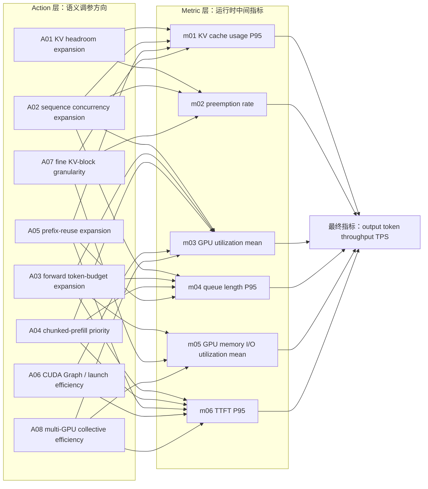
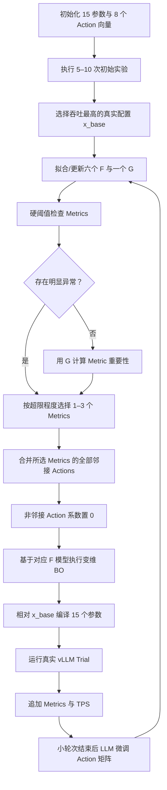

# DIBO v8：动态邻接 Action 贝叶斯调参核心工程方案

> 本版完全按照最新确认的算法重写：先用 5–10 次初始实验建立两层关系并选出最佳基础配置；每轮选择 1–3 个重要 Metrics，将它们在图中连接的全部 Actions 作为 BO 搜索变量，未选中的 Action 系数全部设为 0；BO 直接使用 Action–Metric 贝叶斯模型把 Metrics 推向正常区间；探索过程中，LLM 根据新实验结果持续微调下一轮使用的 Action 方向向量。

---

## 1. 最终算法决策

1. 推理引擎使用 vLLM，不使用 Docker 或独立 Engine 容器。
2. 参数顺序始终为 p01–p15，Action 顺序始终为 A01–A08。
3. 所有 15 个参数始终保留在编译器和实验记录中，不维护参数启用、排除或冻结状态。
4. 所有 8 个 Actions 始终保留在 Action 库中。
5. 初始阶段执行 5–10 次实验，正式实现默认执行 10 次。
6. 从初始成功实验中选择吞吐最高的真实配置作为固定基础配置 `x_base`。
7. 后续每个候选都从 `x_base` 重新计算，不在上一个候选配置上连续累加。
8. G 保持为 `Metrics → output_token_throughput_tps` 的贝叶斯回归模型。
9. 每轮先用硬阈值寻找明显异常的 Metrics；没有明显异常时，再由 G 分析重要 Metrics。
10. 每轮选择 1–3 个 Metrics，默认选择 2 个。
11. 本轮 BO Action 集等于这些 Metrics 在 Action–Metric 图上的全部邻接 Actions 的并集，不限制 Action 数量。
12. 未进入并集的 Actions 在本轮严格设置 `z_a=0`，不参与调节。
13. BO 的目标是让选中 Metrics 接近正常区间，而不是建立额外的 `Action→吞吐` 模型。
14. 探索分成若干 BO 小轮次；每个小轮次结束后，LLM 可以更新下一轮 Action 矩阵。
15. 删除独立 H 层、额外局部吞吐 GP、复杂故障恢复、故障注入、租约、自动选主和生产告警。

---

## 2. 为什么不再使用“局部 GP”

上一版提出局部 GP，是因为普通 BO 通常需要一个“搜索变量到优化目标”的代理模型，例如：

$$
(z_{A02},z_{A04})\rightarrow TPS
$$

但这与你的两层设计重复。你的系统已经有：

$$
F_k:\text{与 }m_k\text{ 相连的 Actions}\rightarrow m_k
$$

以及：

$$
G:(m_1,...,m_6)\rightarrow TPS
$$

因此本版不再训练额外的 `Action→TPS` 局部 GP。BO 直接使用选中 Metrics 对应的 F 模型后验，搜索所有相连 Action 的系数，使这些 Metrics 靠近正常目标；G 负责判断哪些 Metrics 更值得优先改善，以及在候选接近时进行吞吐方向比较。

本版中的“贝叶斯模型”只有两类：

- 六个 F 模型：每个 Metric 一个 Action–Metric GP。
- 一个 G 模型：六个 Metrics 到吞吐的 GP。

---

## 3. 完整 Action–Metric–Throughput 关系图



### 3.1 每个 Metric 的完整邻接 Action 集

| Metric | 与其建立关系的全部 Actions | Action 数量 |
|---|---|---:|
| m01 KV cache usage P95 | A01、A02、A05、A07 | 4 |
| m02 preemption rate | A01、A02、A07 | 3 |
| m03 GPU utilization mean | A02、A03、A04、A06、A08 | 5 |
| m04 queue length P95 | A02、A03、A04、A05 | 4 |
| m05 GPU memory I/O utilization mean | A03、A07、A08 | 3 |
| m06 TTFT P95 | A03、A04、A05、A06、A08 | 5 |

### 3.2 多 Metric 时的 Action 合并规则

若本轮选中的 Metric 集合为 $M^*$，则 BO Action 集为：

$$
A^*=\bigcup_{m_k\in M^*}N(m_k)
$$

其中 $N(m_k)$ 是图中与 $m_k$ 相连的全部 Actions。

示例：

```text
M* = {m01, m02}
A* = {A01, A02, A05, A07}
BO 维度 = 4
其余 A03、A04、A06、A08 的系数全部为 0
```

```text
M* = {m03, m06}
A* = {A02, A03, A04, A05, A06, A08}
BO 维度 = 6
其余 A01、A07 的系数全部为 0
```

如果 3 个 Metrics 的邻接并集覆盖 8 个 Actions，则本轮 BO 就搜索完整 8 维 Action 空间，不进行人为裁剪。

图中的边表示主要建模关系；BO Action 集严格按这些边生成。

---

## 4. 完整调参流程



### 4.1 阶段 A：初始样本

正式默认 `initial_trials=10`：

| 序号 | 系数设计 | 目的 |
|---|---|---|
| 1 | 所有 Action 系数为 0 | 原始基线 |
| 2–9 | 每次仅一个 Action 为 `+0.8` | 获得八个语义方向的基础响应 |
| 10 | 一个固定 seed 的 Sobol 混合点 | 补充负方向与 Action 交互 |

若只能执行 5–9 次，则保留零向量，再用 maximin/Sobol 选择剩余点；正式实现仍优先使用 10 次，因为 5 次对八个 Action 的覆盖非常有限。

初始候选全部相对初始化配置 `x_init` 编译。非法或与已有最终配置重复的候选在 CPU 编译阶段被替换为下一个 Sobol 点。

### 4.2 阶段 B：选择固定基础配置

从初始阶段的成功 Trial 中选择：

$$
t_{base}=\arg\max_{t\in D_{init}} TPS(t)
$$

并保存：

```text
base_trial_id
x_base：该 Trial 的 15 个最终 vLLM 参数
base_metrics：该 Trial 的六个 Metrics
base_throughput_tps
base_config_hash
```

只有请求成功率达到预设要求的 Trial 才能成为基础样本；吞吐相同时优先选择 TTFT 更小的配置。

`x_base` 在本次完整调参过程中保持不变。每一个 BO 候选都重新从 `x_base` 计算，避免配置在多轮累加后发生不可解释漂移。

### 4.3 阶段 C：多轮优化

每个 BO 小轮次执行：

1. 使用当前所有成功 Trial 更新 F 和 G。
2. 从当前最佳实测 Trial 读取 Metrics。
3. 选择 1–3 个重要 Metrics。
4. 取这些 Metrics 的全部邻接 Actions 并集。
5. 将其他 Action 系数设为 0。
6. BO 在 $[-1,1]^{|A^*|}$ 中生成候选。
7. Compiler 从固定 `x_base` 生成完整 15 参数配置。
8. 执行 1–3 个真实 Trial 并追加数据。
9. LLM 根据新增结果调整 Action 矩阵。
10. 使用新矩阵进入下一小轮次并重新选择 Metrics 和 Actions。

默认配置建议：

```yaml
initial_trials: 10
metric_top_k: 2
metric_top_k_min: 1
metric_top_k_max: 3
bo_rounds: 4
trials_per_bo_round: 3
llm_update_every_round: true
max_total_trials: 22
```

---

## 5. 统一的 15 个 vLLM 参数

| ID | 参数 | 类型 | 初始化值 | 合法域 / Action 尺度 | 正方向 |
|---|---|---|---:|---|---|
| p01 | tensor_parallel_size | 有序整数枚举 | `MIN_FIT_TP` | `{1,2,4,8} ∩ 可用 GPU 数` | 增大 TP |
| p02 | pipeline_parallel_size | 有序整数枚举 | 1 | `{1,2,4} ∩ 可用 GPU 数` | 增大 PP |
| p03 | max_num_seqs | 整数 | 128 | `[32,1024]`，尺度 64 | 增大并发序列数 |
| p04 | max_num_batched_tokens | 整数 | `PROMPT_P95_OR_8192` | `[512,32768]`，尺度 2048 | 增大迭代 token budget |
| p05 | block_size | 有序整数枚举 | 16 | `{8,16,32}` | 使用更大 KV block |
| p06 | gpu_memory_utilization | 浮点 | 0.90 | `[0.70,0.98]`，尺度 0.04 | 提高 GPU/KV 显存比例 |
| p07 | swap_space | 浮点 | 4.0 GiB | `[0,16]`，尺度 2.0 | 增加 CPU swap |
| p08 | cpu_offload_gb | 浮点 | 2.0 GiB | `[0,16]`，尺度 2.0 | 增加 CPU 权重 offload |
| p09 | max_num_partial_prefills | 整数 | 2 | `[1,8]`，尺度 2 | 增加 partial-prefill 数量 |
| p10 | max_long_partial_prefills | 整数 | 1 | `[1,8]`，尺度 1 | 增加长 prompt partial 数量 |
| p11 | long_prefill_token_threshold | 整数 | `PROMPT_P75` | `[256,max_model_len]`，尺度 1024 | 提高长 prompt 判定阈值 |
| p12 | enable_chunked_prefill | 布尔投票 | true | `{false,true}` | 投票 true |
| p13 | enable_prefix_caching | 布尔投票 | 按请求集初始化 | `{false,true}` | 投票 true |
| p14 | disable_custom_all_reduce | 布尔投票 | false | `{false,true}` | 投票 true，即禁用 custom all-reduce |
| p15 | enforce_eager | 布尔投票 | false | `{false,true}` | 投票 true，即强制 eager |

初始化器：

- `MIN_FIT_TP`：可加载模型的最小合法 TP。
- `PROMPT_P95_OR_8192`：prompt P95 对齐 256 后与 8192 取较大值，再裁剪到范围。
- `PROMPT_P75`：prompt P75 对齐 256，再裁剪到 `[256,max_model_len]`。
- p13：请求集有稳定共享前缀时为 true，否则为 false；之后仍正常参与投票。

硬约束：

```text
p01 * p02 <= allocated_gpu_count
num_attention_heads % p01 == 0
num_hidden_layers % p02 == 0
p04 >= p03
1 <= p10 <= p09
256 <= p11 <= max_model_len
0.70 <= p06 <= 0.98
p03、p09、p10 取整到整数
p04、p11 额外对齐到 256
```

---

## 6. 八个 Action 与初始化方向矩阵

### 6.1 Action 语义

| ID | Action | 正方向含义 | 典型场景 |
|---|---|---|---|
| A01 | KV headroom expansion | 增大 KV/显存余量并降低过度并发 | 长上下文、高 KV、抢占较多 |
| A02 | sequence concurrency expansion | 增加可同时处理的序列和配套预算 | 请求多、队列积压、GPU 未吃满 |
| A03 | forward token-budget expansion | 增加每次调度迭代处理的 token 数 | 吞吐优先、prefill 多 |
| A04 | chunked-prefill priority | 加强 chunked prefill 与短 prompt 调度 | 长短混合、队首阻塞 |
| A05 | prefix-reuse expansion | 加强共享前缀 KV 复用 | system prompt/RAG 模板重复 |
| A06 | CUDA Graph / launch efficiency | 倾向非 eager，减少 host/kernel launch 开销 | decode-heavy、短 kernel 多 |
| A07 | fine KV-block granularity | 倾向较小 block，减少 KV 碎片 | 短序列多、长度差异大 |
| A08 | multi-GPU collective efficiency | 增大并行度并倾向 custom all-reduce | 多 GPU 或模型权重较大 |

### 6.2 8×15 矩阵

| Action | p01 | p02 | p03 | p04 | p05 | p06 | p07 | p08 | p09 | p10 | p11 | p12 | p13 | p14 | p15 |
|---|---:|---:|---:|---:|---:|---:|---:|---:|---:|---:|---:|---:|---:|---:|---:|
| A01 | +0.30 | +0.15 | -0.85 | -0.45 | -0.35 | +1.00 | +0.35 | +0.30 | -0.25 | -0.20 | -0.15 | +0.30 | +0.10 | -0.05 | +0.15 |
| A02 | +0.15 | -0.20 | +1.00 | +0.85 | +0.15 | +0.45 | +0.10 | -0.25 | +0.35 | +0.20 | +0.10 | +0.40 | +0.20 | -0.10 | -0.35 |
| A03 | +0.15 | -0.10 | +0.30 | +1.00 | +0.10 | +0.25 | +0.05 | -0.20 | +0.35 | +0.25 | +0.30 | +0.70 | +0.05 | -0.10 | -0.25 |
| A04 | +0.05 | +0.10 | +0.15 | -0.55 | -0.10 | +0.15 | +0.05 | -0.05 | +0.85 | -0.70 | -0.65 | +1.00 | +0.10 | -0.05 | -0.15 |
| A05 | -0.05 | -0.03 | +0.25 | +0.20 | -0.30 | +0.40 | +0.05 | -0.05 | +0.10 | +0.05 | -0.10 | +0.15 | +1.00 | -0.03 | -0.10 |
| A06 | -0.10 | -0.10 | +0.30 | +0.20 | +0.05 | -0.20 | -0.05 | -0.10 | +0.10 | +0.05 | +0.05 | +0.15 | +0.05 | -0.10 | -1.00 |
| A07 | +0.05 | +0.05 | +0.35 | +0.15 | -1.00 | +0.30 | +0.10 | +0.05 | +0.10 | +0.05 | -0.05 | +0.10 | +0.30 | -0.03 | -0.05 |
| A08 | +1.00 | +0.45 | +0.20 | +0.35 | +0.05 | +0.25 | +0.10 | -0.25 | +0.10 | +0.05 | +0.05 | +0.15 | +0.05 | -1.00 | -0.30 |

语义锚点：A01/p06、A02/p03、A03/p04、A04/p12、A05/p13、A06/p15、A07/p05、A08/p01+p14。

A06 对应的是 host/kernel-launch-bound，不是 KV、HBM、算力或多 GPU 通信瓶颈。

---

## 7. 相对最佳基础配置的编译器

### 7.1 完整系数向量

虽然本轮 BO 的维度等于 $|A^*|$，存储时始终补齐为八维：

$$
z_a=0,\quad a\notin A^*
$$

这表示未选 Action 本轮没有任何调参作用。

### 7.2 数值和整数参数

初始阶段相对 `x_init` 编译；选择最佳基础样本后，所有优化候选相对 `x_base` 编译：

$$
r_i=x_{base,i}+s_i\sum_{a\in A^*}z_aw_{a,i}
$$

处理顺序：

1. 汇总全部选中 Actions 的增量。
2. 裁剪到参数合法范围。
3. 整数使用 `Decimal ROUND_HALF_UP` 一次性取整。
4. p04、p11 对齐到 256。
5. 检查联合约束。

每个候选都从同一个 `x_base` 重新计算：

```text
正确：x_candidate = compile(x_base, W_current, z_current)
错误：x_candidate = compile(x_previous_trial, W_current, z_current)
```

### 7.3 布尔和有序枚举投票

对于布尔 p12–p15：

```text
base value=true  → base_vote=+0.35
base value=false → base_vote=-0.35
```

对于有序枚举 p01、p02、p05，以 `x_base` 中的值作为 anchor，起始票为 0。

$$
vote_i=b_i+\sum_{a\in A^*}z_aw_{a,i}
$$

- `vote > +0.35`：布尔为 true；有序枚举向更大相邻值移动一步。
- `vote < -0.35`：布尔为 false；有序枚举向更小相邻值移动一步。
- 其余情况：保持 `x_base` 的值。

### 7.4 CompileTrace

每个 Trial 保存：

```yaml
trial_id: trial_012
phase: bo
bo_round: 1
action_version: 2
base_trial_id: trial_007
selected_metrics: [m01, m02]
selected_actions: [A01, A02, A05, A07]
coefficients:
  A01: 0.40
  A02: -0.20
  A03: 0.00
  A04: 0.00
  A05: 0.65
  A06: 0.00
  A07: 0.10
  A08: 0.00
numeric_decisions: {}
categorical_decisions: {}
final_config: {}
effective_parameter_delta: {}
constraint_errors: []
config_hash: string
```

---

## 8. 六个 F 模型与一个 G 模型

### 8.1 F 的图约束

每个 Metric 建立一个 GP，并只允许其图邻接 Actions 参与该 Metric 的搜索：

$$
F_k:A_{N(k)}\rightarrow m_k
$$

具体为：

```text
F01(A01,A02,A05,A07) → m01
F02(A01,A02,A07)     → m02
F03(A02,A03,A04,A06,A08) → m03
F04(A02,A03,A04,A05) → m04
F05(A03,A07,A08)     → m05
F06(A03,A04,A05,A06,A08) → m06
```

### 8.2 LLM 更新后仍能使用历史数据

如果 LLM 修改了方向矩阵，同一个系数 `z` 可能生成不同的 vLLM 参数。只把 `z` 当作 GP 输入会使历史数据含义漂移。

因此 F 的实现形式为：

$$
z\xrightarrow{\text{当前 }W+Compiler}x
\xrightarrow{\phi(x,x_{base})}\widetilde F_k\rightarrow m_k
$$

其中 `phi` 是 `TraceEncoder`：

- 浮点/整数：编码为相对 `x_base` 的归一化最终参数增量。
- 有序枚举：编码为最终候选索引与基础索引之差。
- 布尔：编码为 `-1/0/+1`，表示相对基础值的变化。

系统接口仍表现为 `Action → Metric`；内部使用实际执行参数的稳定编码，仅用于保证 Action 矩阵在线更新后历史 Trial 仍可比较。这不是额外模型。

### 8.3 F 的训练输出

每个 F 返回：

```text
posterior_mean
posterior_variance
training_trial_ids
fit_status
feature_order
action_neighbors
```

建议使用带 ARD 的 Matérn 5/2 GP。数据不足或输出接近常量时标记模型不稳定，本轮对应 Action 空间先执行 Sobol 探索。

### 8.4 G：Metrics → Throughput

$$
G(m_1,m_2,m_3,m_4,m_5,m_6)\rightarrow \widehat{TPS}
$$

G 使用所有 Metrics 完整、吞吐有效且请求成功的 Trial。由于 G 的输入是实际 Metrics，Action 矩阵更新不会改变历史样本的含义。

G 的职责只有：

1. 没有明显阈值问题时，计算各 Metric 对吞吐的重要性。
2. 为多 Metric BO 提供改善方向和权重。
3. 当多个候选的 Metric 距离接近时，优先选择预测吞吐更高者。

G 不直接产生 Action 系数。

---

## 9. 每轮 Metric 选择

### 9.1 Metrics 定义

| ID | 名称 | 来源 | 单位/聚合 |
|---|---|---|---|
| m01 | kv_cache_usage_p95 | vLLM Prometheus | ratio，窗口 P95 |
| m02 | preemption_rate | vLLM counter | preemptions/completed requests |
| m03 | gpu_utilization_mean | NVML | ratio，窗口均值 |
| m04 | queue_length_p95 | vLLM waiting requests | requests，窗口 P95 |
| m05 | gpu_memory_io_utilization_mean | NVML memory utilization | ratio，窗口均值 |
| m06 | ttft_p95 | benchmark 请求记录 | seconds，P95 |

最终指标：`output_token_throughput_tps`。

### 9.2 第一优先级：明显越界指标

只对方向明确的 Metrics 使用硬阈值：

| Metric | 初始规则 | 正常目标 |
|---|---|---|
| m01 | `m01 >= 0.90` | 降到 KV 正常上界以下 |
| m02 | `m02 >= preemption_limit` | 接近 0 或低于限制 |
| m04 | `m04 >= queue_limit` | 低于固定队列上界 |
| m06 | `m06 >= ttft_slo_s` | 低于 TTFT SLO |

m03 和 m05 不单独使用“越高越坏”的规则；它们主要由 G 分析。

超限严重度：

$$
severity_k=\max\left(0,\frac{m_k-T_k}{scale_k+\epsilon}\right)
$$

存在超限项时，按 severity 选择 1–3 个 Metrics；默认最多 2 个，第三个只有在其严重度达到第二名的 80% 时加入。

### 9.3 第二优先级：G 的反事实重要性

没有硬阈值超限时，从当前吞吐最高的 25% Trial 中计算 Metric 健康参考值 $m_k^*$：

$$
importance_k=\max\left(0,G(m_{-k},m_k^*)-G(m)\right)
$$

含义：只把第 k 个 Metric 换成高吞吐样本的健康值时，G 预计 TPS 能提高多少。

选择规则：

- 至少选择 1 个、默认选择 Top-2、最多选择 3 个 Metrics。
- 第三名 importance 不低于第二名的 80% 才加入。
- 若 G 尚未就绪或所有 importance 接近 0，则使用不确定性最高的 Metric，进入探索模式。

### 9.4 输出结构

```yaml
reference_trial_id: trial_015
mode: hard_threshold  # 或 g_counterfactual / exploration
selected_metrics: [m01, m02]
scores: {m01: 0.82, m02: 0.67}
normal_targets:
  m01: {kind: upper, value: 0.85}
  m02: {kind: upper, value: 0.01}
```

---

## 10. 所有邻接 Actions 的贝叶斯优化

### 10.1 BO 维度不是固定值

BO 输入维度由本轮 $A^*$ 决定，可能是 3、4、5、6、7 或 8。实现不得只支持二维。

完整八维系数向量中：

```python
for action_id in ACTION_ORDER:
    if action_id not in selected_actions:
        z[action_id] = 0.0
```

### 10.2 Metric 正常距离

对于上界型 Metric：

$$
d_k(m)=\max\left(0,\frac{m-T_k}{scale_k}\right)
$$

对于下界型 Metric：

$$
d_k(m)=\max\left(0,\frac{T_k-m}{scale_k}\right)
$$

对于区间型 Metric：

$$
d_k(m)=\frac{distance(m,[L_k,U_k])}{scale_k}
$$

m03、m05 或由 G 选出的其他指标，其正常参考区间来自高吞吐 Trial 的稳健分位数。

### 10.3 多 Metric 联合目标

对本轮选中的 Metric 集 $M^*$：

$$
Loss(z)=\sum_{m_k\in M^*}\alpha_k d_k(F_k(z))
$$

其中：

- 硬阈值分支的 $\alpha_k$ 来自归一化 severity。
- G 分支的 $\alpha_k$ 来自归一化 importance。
- 权重和为 1。

BO 最大化 `-Loss` 的期望改进，并利用 F 后验方差保留探索。若多个候选的预期 Loss 基本相同，使用 `G(F(z))` 预测吞吐作为次级排序。

### 10.4 编译感知候选生成

由于整数、枚举和布尔投票不可微，首版不对编译器求梯度：

1. 在 $[-1,1]^{|A^*|}$ 内生成 Sobol/随机候选池。
2. 补全八维系数，未选 Actions 为 0。
3. 使用当前 LLM Action 矩阵和 `x_base` 编译。
4. 删除非法配置和重复 `config_hash`。
5. 用 F 后验计算每个候选的期望 Metric Loss。
6. 选择 acquisition 最大的候选真实执行。

这仍然是贝叶斯优化：GP 提供后验，acquisition 决定下一次昂贵实验；候选池只是处理离散编译器的实现方式。

### 10.5 一个 BO 小轮次

默认一个小轮次运行 3 次 Trial：

```text
选择 Metrics 与 Actions
→ Suggest 1
→ 实测并更新 F/G
→ Suggest 2
→ 实测并更新 F/G
→ Suggest 3
→ 实测
→ LLM review
→ 下一小轮次重新选择 Metrics 与 Actions
```

同一小轮次内 Action 矩阵不改变，保证 acquisition 的搜索面稳定。

---

## 11. LLM 在探索过程中的 Action 更新

### 11.1 更新频率

- 默认每个 BO 小轮次结束后调用一次 LLM，即每 3 个新 Trial 更新一次。
- 可配置为每 1–3 个 Trial 一次，但修改结果只在下一个小轮次生效。
- LLM 更新不改变 `x_base`，只改变后续候选使用的方向矩阵 $W$。

这满足“探索过程中不断更新 Action 向量”，同时避免一个 acquisition 尚未完成时搜索空间突然变化。

### 11.2 LLM 输入证据

- 当前 8×15 方向矩阵和语义锚点。
- 本小轮次选择的 Metrics 与全部邻接 Actions。
- 每个候选系数、最终 15 参数、有效参数增量和 CompileTrace。
- 实测六个 Metrics、吞吐和请求成功率。
- F 对选中 Metrics 的后验变化。
- G 的 Metric importance 与健康参考值。
- 本轮最佳/最差候选相对 `x_base` 的差异。

### 11.3 LLM 更新范围

LLM 只修改本小轮次实际探索过的 Actions。其他 Actions 保持原值。

约束：

```text
单次单元权重变化绝对值 <= 0.10
所有权重范围 [-1,1]
锚点绝对值 >= 0.80
锚点符号不得翻转
非锚点绝对值不得小于 0.02
不得修改 Action–Metric 图
不得修改参数范围、Metric 阈值或 x_base
每项修改必须引用 Trial ID
证据不足时返回 keep
```

### 11.4 LLM 输出

```json
{
  "decision": "modify",
  "parent_action_version": 2,
  "effective_from_bo_round": 3,
  "updates": [
    {
      "action_id": "A01",
      "parameter_id": "p03",
      "old_weight": -0.85,
      "new_weight": -0.92,
      "evidence_trial_ids": ["trial_013", "trial_014", "trial_015"],
      "reason": "降低并发比增加 swap 更稳定地降低了 m01 和 m02"
    }
  ]
}
```

输出校验通过后生成新的 `actions_vN.yaml`；校验失败则下一轮继续使用当前矩阵，不反复调用。

---

## 12. 机器可读的初始化图与矩阵

```yaml
schema_version: 8
parameter_order: [p01, p02, p03, p04, p05, p06, p07, p08, p09, p10, p11, p12, p13, p14, p15]
action_order: [A01, A02, A03, A04, A05, A06, A07, A08]
metric_order: [m01, m02, m03, m04, m05, m06]
target: output_token_throughput_tps
coefficient_bounds: [-1.0, 1.0]
unselected_action_coefficient: 0.0
vote_threshold: 0.35
integer_rounding: ROUND_HALF_UP_AFTER_SUM
direction_vectors:
  A01: [0.30, 0.15, -0.85, -0.45, -0.35, 1.00, 0.35, 0.30, -0.25, -0.20, -0.15, 0.30, 0.10, -0.05, 0.15]
  A02: [0.15, -0.20, 1.00, 0.85, 0.15, 0.45, 0.10, -0.25, 0.35, 0.20, 0.10, 0.40, 0.20, -0.10, -0.35]
  A03: [0.15, -0.10, 0.30, 1.00, 0.10, 0.25, 0.05, -0.20, 0.35, 0.25, 0.30, 0.70, 0.05, -0.10, -0.25]
  A04: [0.05, 0.10, 0.15, -0.55, -0.10, 0.15, 0.05, -0.05, 0.85, -0.70, -0.65, 1.00, 0.10, -0.05, -0.15]
  A05: [-0.05, -0.03, 0.25, 0.20, -0.30, 0.40, 0.05, -0.05, 0.10, 0.05, -0.10, 0.15, 1.00, -0.03, -0.10]
  A06: [-0.10, -0.10, 0.30, 0.20, 0.05, -0.20, -0.05, -0.10, 0.10, 0.05, 0.05, 0.15, 0.05, -0.10, -1.00]
  A07: [0.05, 0.05, 0.35, 0.15, -1.00, 0.30, 0.10, 0.05, 0.10, 0.05, -0.05, 0.10, 0.30, -0.03, -0.05]
  A08: [1.00, 0.45, 0.20, 0.35, 0.05, 0.25, 0.10, -0.25, 0.10, 0.05, 0.05, 0.15, 0.05, -1.00, -0.30]
action_metric_adjacency:
  A01: [1, 1, 0, 0, 0, 0]
  A02: [1, 1, 1, 1, 0, 0]
  A03: [0, 0, 1, 1, 1, 1]
  A04: [0, 0, 1, 1, 0, 1]
  A05: [1, 0, 0, 1, 0, 1]
  A06: [0, 0, 1, 0, 0, 1]
  A07: [1, 1, 0, 0, 1, 0]
  A08: [0, 0, 1, 0, 1, 1]
metric_neighbors:
  m01: [A01, A02, A05, A07]
  m02: [A01, A02, A07]
  m03: [A02, A03, A04, A06, A08]
  m04: [A02, A03, A04, A05]
  m05: [A03, A07, A08]
  m06: [A03, A04, A05, A06, A08]
```

---

## 13. 工程目录

```text
dibo/
├── pyproject.toml
├── README.md
├── configs/
│   ├── experiment.yaml
│   ├── parameters.yaml
│   ├── actions_v1.yaml
│   └── graph.yaml
├── data/
│   └── requests/
├── src/dibo/
│   ├── schemas.py
│   ├── compiler.py
│   ├── trace_encoder.py
│   ├── engine.py
│   ├── benchmark.py
│   ├── metrics.py
│   ├── trial.py
│   ├── store.py
│   ├── models.py
│   ├── selector.py
│   ├── optimizer.py
│   ├── llm_update.py
│   ├── controller.py
│   ├── report.py
│   └── cli.py
├── tests/
│   ├── unit/
│   ├── interface/
│   └── e2e/
└── runs/
    └── <experiment_id>/
        ├── experiment_snapshot.yaml
        ├── base_trial.json
        ├── action_versions/
        ├── trials/
        ├── selections/
        ├── llm_reviews/
        └── report.md
```

依赖方向：

```text
CLI → Controller
Controller → Compiler / TrialRunner / Models / Selector / Optimizer / LLMUpdater
TrialRunner → Engine / Benchmark / Metrics / Store
Optimizer → F/G posterior / Compiler
Models → TraceEncoder / TrialStore
Compiler → ParameterSpec / ActionBundle
```

底层执行模块不得导入 Controller，LLM 模块不得直接启动 vLLM。

---

## 14. 核心配置

### 14.1 experiment.yaml

```yaml
experiment_id: dibo_h20_v8_run01
seed: 42

engine:
  version: 0.11.2
  model: /path/to/model
  tokenizer: /path/to/tokenizer
  dtype: bfloat16
  host: 127.0.0.1
  port: 8000
  max_model_len: 8192
  allocated_gpu_count: 1
  allocated_gpu_uuids: [GPU-REPLACE-ME]

workload:
  request_file: data/requests/mixed_v1.jsonl
  backend: openai-chat
  endpoint: /v1/chat/completions
  streaming: true
  num_prompts: 128
  warmup_prompts: 32
  request_rate: 4.0
  max_concurrency: 64
  burstiness: 1.0
  output_len: 512
  ignore_eos: true
  chat_template_id: model_default
  prefix_profile: shared_prefix_30pct
  ttft_slo_s: 1.0

tuning:
  initial_trials: 10
  metric_top_k: 2
  metric_top_k_min: 1
  metric_top_k_max: 3
  third_metric_ratio: 0.80
  bo_rounds: 4
  trials_per_bo_round: 3
  max_total_trials: 22
  coefficient_low: -1.0
  coefficient_high: 1.0
  candidate_pool_size: 2048
  llm_update_interval_trials: 3

thresholds:
  m01: {kind: upper, trigger: 0.90, target: 0.85, scale: 0.05}
  m02: {kind: upper, trigger: 0.02, target: 0.01, scale: 0.01}
  m04: {kind: upper, trigger: REPLACE_AFTER_PILOT, target: REPLACE_AFTER_PILOT, scale: REPLACE_AFTER_PILOT}
  m06: {kind: upper, trigger_from: workload.ttft_slo_s, target_from: workload.ttft_slo_s, scale: 0.10}
```

`REPLACE_AFTER_PILOT` 必须在正式运行前替换成数值。配置解析器不接受该字符串进入真实 Trial。

### 14.2 ActionBundle

```python
class ActionVector(BaseModel):
    action_id: Literal["A01", "A02", "A03", "A04", "A05", "A06", "A07", "A08"]
    name: str
    positive_semantics: str
    direction_vector: list[float]  # 必须恰好 15 项
    anchor_parameter_ids: list[str]

class ActionBundle(BaseModel):
    schema_version: Literal[8]
    action_version: int
    parent_action_version: int | None
    source: Literal["seed", "llm_update"]
    parameter_order: list[str]
    action_order: list[str]
    metric_order: list[str]
    actions: list[ActionVector]
    action_metric_adjacency: list[list[int]]
```

不设置 `active`、`tunable`、`required_capabilities` 或参数屏蔽字段。

---

## 15. 各模块功能、接口和单元测试

### M01：schemas.py

职责：定义 ParameterSpec、ActionBundle、CompileTrace、WorkloadSpec、TrialResult、MetricSelection、BOSelection 和 LLMUpdate。

接口：

```python
def load_experiment(path: Path) -> ExperimentConfig: ...
def load_actions(path: Path) -> ActionBundle: ...
def load_graph(path: Path) -> ActionMetricGraph: ...
```

单元测试：

- 参数顺序必须恰好 p01–p15。
- Action 顺序必须恰好 A01–A08。
- 每行方向向量必须为 15 个有限数。
- Graph 必须为 8×6 二值矩阵。
- 未知字段和错误类型直接拒绝。

### M02：compiler.py

职责：将固定基础配置、当前 Action 矩阵和八维系数编译为完整 vLLM 配置。

接口：

```python
def compile_config(
    base_config: EngineConfig,
    actions: ActionBundle,
    selected_actions: list[str],
    coefficients: dict[str, float],
) -> CompileTrace: ...
```

单元测试：

- 未选 Action 自动补为精确的 0.0。
- 零向量恢复 `x_base`。
- 所有数值增量只相对 `x_base`。
- `ROUND_HALF_UP`、256 对齐和边界行为正确。
- bool/choice 只经过投票。
- 同一输入产生同一 config hash。
- TP、PP、p04、p09–p11 联合约束正确。

### M03：trace_encoder.py

职责：把实际执行的最终配置编码为相对 `x_base` 的稳定特征，使 LLM 更新 Action 矩阵后旧 Trial 仍可用于 F。

接口：

```python
def encode_trace(trace: CompileTrace, base: EngineConfig) -> EncodedConfig: ...
```

单元测试：

- 相同最终配置在不同 Action 版本下得到相同编码。
- 相同 z 在不同方向矩阵下若编译结果不同，编码也不同。
- bool、ordered choice 和 numeric 的编码可复算。

### M04：engine.py

职责：使用参数数组启动 vLLM、等待 `/health`、保存日志并停止自己启动的进程。

接口：

```python
async def start(config: EngineConfig, run_dir: Path) -> EngineHandle: ...
async def wait_ready(handle: EngineHandle, timeout_s: float) -> None: ...
async def stop(handle: EngineHandle) -> None: ...
```

单元测试：CLI 参数映射、端口、PID 身份和超时；禁止 `shell=True` 和全局 kill。

### M05：benchmark.py

职责：读取固定请求集，执行 warmup 和正式请求，输出吞吐、TTFT 和请求成功率。

接口：

```python
async def run_benchmark(handle: EngineHandle, workload: WorkloadSpec) -> BenchmarkResult: ...
```

单元测试：请求 hash、seed、输出 token 计数、失败响应和时间窗口。

### M06：metrics.py

职责：抓取 vLLM Prometheus 数据和指定 GPU UUID 的 NVML 数据，聚合 m01–m05。

接口：

```python
async def start_sampling(handle: EngineHandle, gpu_uuid: str) -> Sampler: ...
async def stop_and_aggregate(sampler: Sampler) -> MetricSummary: ...
```

单元测试：counter 差分、P95、均值、缺失值、采样窗口和 GPU UUID。

### M07：trial.py 与 store.py

职责：串联启动、warmup、采集、benchmark、停止和结果保存。

接口：

```python
async def run_trial(spec: TrialSpec) -> TrialResult: ...
def save_trial(result: TrialResult) -> Path: ...
def load_trials(experiment_id: str) -> list[TrialResult]: ...
```

单元测试：成功路径、启动失败、benchmark 失败、Metric 缺失和原子结果写入。失败只记录一次，不自动重跑。

### M08：models.py

职责：训练六个 F GP 和一个 G GP，输出后验均值、方差及训练证据。

接口：

```python
def fit_f(trials: list[TrialResult], graph: ActionMetricGraph) -> dict[str, MetricGP]: ...
def fit_g(trials: list[TrialResult]) -> ThroughputGP: ...
```

单元测试：七个模型的输入输出形状、标准化、缺失值、少样本状态和 Action 版本变化后的编码一致性。

### M09：selector.py

职责：硬阈值/G 反事实选 Metrics，并计算全部邻接 Actions 的并集。

接口：

```python
def select_metrics(reference: TrialResult, g: ThroughputGP) -> MetricSelection: ...
def union_neighbor_actions(metrics: list[str], graph: ActionMetricGraph) -> list[str]: ...
```

单元测试：

- 硬阈值优先于 G。
- 选择数量位于 1–3。
- m01+m02 的并集为 A01/A02/A05/A07。
- m03+m06 的并集为 A02/A03/A04/A05/A06/A08。
- 八个 Action 的输出顺序始终稳定。

### M10：optimizer.py

职责：对全部邻接 Actions 生成变维候选池，使用 F 后验最小化加权 Metric Loss。

接口：

```python
def suggest(
    metric_selection: MetricSelection,
    selected_actions: list[str],
    f_models: dict[str, MetricGP],
    g_model: ThroughputGP,
    base_config: EngineConfig,
    action_bundle: ActionBundle,
    history: list[TrialResult],
) -> Candidate: ...
```

单元测试：

- 支持 1–8 个 Action 维度。
- 未选 Action 必须为 0。
- 候选相对固定 `x_base` 编译。
- 重复和非法配置不返回。
- 一个 Metric 与多个 Metrics 的 Loss 都能计算。
- G 只作次级排序，不直接优化 z→TPS 模型。

### M11：llm_update.py

职责：生成本轮证据、调用 LLM、验证修改并保存新 Action 版本。

接口：

```python
async def review_round(evidence: EvidenceBundle) -> ActionUpdate: ...
def apply_update(bundle: ActionBundle, update: ActionUpdate) -> ActionBundle: ...
```

单元测试：修改幅度、锚点、证据 Trial、版本号、未探索 Action 不变以及非法响应拒绝。

### M12：controller.py

职责：实现初始实验、基础样本选择、多轮 Metric/Action 选择、BO Trial、LLM 更新和结束条件。

接口：

```python
async def run_experiment(config: ExperimentConfig) -> ExperimentSummary: ...
```

单元测试：使用 Fake 模块检查完整调用顺序、基础样本只选择一次、每轮重新选 Metrics、总 Trial 数不超限。

### M13：report.py 与 cli.py

职责：生成命令入口和最终报告。

必须报告：

- 初始十次实验与基础样本。
- 每轮选择的 Metrics、邻接 Actions 和 BO 维度。
- 每次 Action 矩阵修改。
- 基线、`x_base` 和最终最佳真实配置。
- 吞吐提升、TTFT、成功率以及失败 Trial。

---

## 16. 四组接口测试

### IF01：Selector → Graph → Optimizer

输入选中 Metrics，验证完整邻接并集；Optimizer 收到所有邻接 Actions，其他系数全为 0。

### IF02：Optimizer → Compiler → TrialRunner

变维 BO 候选补齐八维后，相对 `x_base` 编译成 15 参数；真实运行读取的配置必须与 Trace 完全一致。

### IF03：TrialStore → TraceEncoder → F/G

不同 Action 版本的 Trial 均从实际最终配置生成稳定特征；F/G 的训练 Trial ID、Metric 和吞吐能够追溯。

### IF04：TrialResult → LLMUpdater → 下一 BO 轮次

本轮新增 Trial 进入 Evidence；合法矩阵修改只在下一轮生效；下一轮 Compiler 使用新版本并保持同一个 `x_base`。

---

## 17. 两个端到端测试

### E2E-01：CPU 合成闭环

构造可控函数：

```text
Action + Matrix → 编译参数 → 六个 synthetic Metrics → synthetic TPS
```

验收：

1. 执行 10 个初始点并正确选择最高 TPS 基础样本。
2. 至少一次触发硬阈值选择。
3. 至少一次触发 G 反事实选择。
4. 多 Metric 能产生完整邻接 Action 并集。
5. BO 同时调节所有邻接 Actions，其他 Actions 始终为 0。
6. 多轮后选中 Metrics 更接近目标区间。
7. LLM 修改矩阵后，下一轮使用新矩阵且旧 Trial 编码仍一致。

### E2E-02：真实 vLLM 小闭环

为节省 GPU，只执行：

1. 5 次初始 Trial。
2. 选择最佳基础配置。
3. 拟合初步 F/G。
4. 选择 1–2 个 Metrics 及全部邻接 Actions。
5. 执行 2 个 BO 候选。
6. 调用一次 LLM 更新。
7. 使用新矩阵执行 1 个下一轮候选。
8. 输出最佳真实配置。

小闭环只验证接口和算法路径，不要求证明统计显著的性能提升。

---

## 18. 环境与运行方式

### 18.1 环境原则

- 使用一个 Conda/venv 环境。
- vLLM 与 DIBO 位于同一环境。
- 不使用 Docker。
- vLLM 是 Controller 启动的本地子进程。
- 目标版本默认 `vLLM 0.11.2`；PyTorch、CUDA 和驱动使用 H20 实际兼容组合。

建议依赖：

```text
python 3.10
vllm 0.11.2
pydantic >=2
pyyaml
numpy
pandas
scipy
scikit-learn 或 gpytorch/botorch
torch
httpx
pynvml
pytest
pytest-asyncio
```

### 18.2 开始编码前检查

```text
Python 依赖可导入
torch 能看到获配 H20
GPU UUID 与配置一致
模型和 tokenizer 可读取
vllm serve --help 包含 p01–p15 对应参数
基线服务可以完成一个真实请求
Prometheus 与 NVML 指标可以读取
```

如果计算节点不能访问 LLM API，只保留简单文件往返：计算节点写一个请求 JSON，联网节点单 worker 返回响应 JSON。仅实现 request ID、schema、原子写入和超时。

---

## 19. Controller 伪代码

```python
async def run_dibo(cfg):
    history = []
    actions = load_actions(cfg.initial_action_version)
    x_init = initialize_engine_config(cfg)

    # 阶段一：5–10 个初始实验
    for z in build_initial_design(cfg.initial_trials):
        trace = compile_config(
            base_config=x_init,
            actions=actions,
            selected_actions=ACTION_ORDER,
            coefficients=z,
        )
        if trace.valid and not duplicated(trace, history):
            history.append(await run_trial(trace, cfg.workload))

    # 只选择一次，后续始终相对它计算
    base_trial = max_successful_by_throughput(history)
    x_base = base_trial.final_config
    save_base_trial(base_trial)

    # 阶段二：多轮 BO + LLM 更新
    for bo_round in range(cfg.bo_rounds):
        f_models = fit_f(history, cfg.graph, x_base)
        g_model = fit_g(history)

        reference = max_successful_by_throughput(history)
        metric_selection = select_metrics(reference, g_model, cfg.thresholds)
        selected_actions = union_neighbor_actions(
            metric_selection.metric_ids,
            cfg.graph,
        )

        for _ in range(cfg.trials_per_bo_round):
            candidate = suggest(
                metric_selection=metric_selection,
                selected_actions=selected_actions,
                f_models=f_models,
                g_model=g_model,
                base_config=x_base,
                action_bundle=actions,
                history=history,
            )

            assert all(
                candidate.z[a] == 0.0
                for a in ACTION_ORDER
                if a not in selected_actions
            )

            history.append(await run_trial(candidate.trace, cfg.workload))
            f_models = fit_f(history, cfg.graph, x_base)
            g_model = fit_g(history)

        evidence = build_llm_evidence(
            bo_round=bo_round,
            selected_metrics=metric_selection.metric_ids,
            selected_actions=selected_actions,
            new_trials=history[-cfg.trials_per_bo_round:],
            action_bundle=actions,
        )
        update = await llm_review(evidence)
        actions = apply_if_valid(actions, update)

    return build_report(history, base_trial, actions)
```

---

## 20. CLI

```bash
dibo env-check --config configs/experiment.yaml
dibo compile --base-trial trial_007 --actions-version 2 --z configs/example_z.yaml
dibo initial-run --config configs/experiment.yaml
dibo tune --config configs/experiment.yaml
dibo llm-review --run runs/<experiment_id> --round 2
dibo report --run runs/<experiment_id>
```

`compile` 只生成配置和 Trace；`initial-run` 只运行初始设计并选 `x_base`；`tune` 执行完整多轮闭环。

---

## 21. 十四天实施计划

| 天 | 工作 | 当天完成标志 |
|---|---|---|
| Day 1 | 建立统一环境和真实 vLLM 基线 | 一个请求成功返回 |
| Day 2 | 完成参数、Action、Graph 和 Schema | 15/8/6 顺序与矩阵校验通过 |
| Day 3 | 实现相对基础配置的数值编译 | 数值和整数测试通过 |
| Day 4 | 实现布尔/枚举投票与 CompileTrace | 投票、死区、hash 测试通过 |
| Day 5 | 实现 Engine、Benchmark 和 Metrics | 单次真实 Trial 可运行和保存 |
| Day 6 | 实现初始 5–10 点设计与基础样本选择 | Fake 环境选出正确 `x_base` |
| Day 7 | 实现 TraceEncoder 和 Trial 数据集 | 跨 Action 版本编码一致 |
| Day 8 | 实现六个 F 模型 | 每个 Metric 的 GP 可训练预测 |
| Day 9 | 实现 G 和硬阈值/G MetricSelector | 两类选择分支均通过 |
| Day 10 | 实现 Graph 邻接并集和变维搜索空间 | 1–8 维 Action 集正确 |
| Day 11 | 实现基于 Metric Loss 的 BO | 所有邻接 Actions 参与，其他为 0 |
| Day 12 | 实现 LLM Evidence 和在线矩阵更新 | 新版本只在下一轮生效 |
| Day 13 | 实现 Controller、报告和 CPU E2E | 完整合成闭环通过 |
| Day 14 | 运行真实 vLLM 小闭环 | 输出基础配置、选择轨迹和最佳实测配置 |

---

## 22. 最终验收标准

- [ ] 初始阶段支持 5–10 个实验，默认 10 个。
- [ ] 基础样本来自初始成功 Trial 中的最高实测吞吐。
- [ ] `x_base` 只选择一次，所有后续候选都相对它重新编译。
- [ ] 所有 15 个参数和 8 个 Actions 始终保存在配置、矩阵和 Trace 中。
- [ ] F 包含六个 Metric 贝叶斯模型，G 为 Metrics→Throughput 模型。
- [ ] 没有额外的 Action→TPS 局部 GP 或 H 层。
- [ ] 每轮选择 1–3 个 Metrics。
- [ ] BO Action 集等于这些 Metrics 的全部图邻接 Actions 的并集。
- [ ] BO 支持 1–8 个 Action 维度，不固定为 Top-2 Actions。
- [ ] 本轮所有非邻接 Actions 的系数严格等于 0。
- [ ] BO 的主目标是让选中 Metrics 接近正常目标。
- [ ] G 用于 Metric 重要性、权重和候选次级排序。
- [ ] 每个 BO 小轮次后，LLM 可基于新增实测结果更新下一轮 Action 矩阵。
- [ ] Action 更新后历史真实配置仍可通过 TraceEncoder 正确进入 F。
- [ ] 最终推荐配置必须是成功执行过的真实 Trial。
- [ ] CPU 合成闭环和真实 vLLM 小闭环均通过。

---

## 23. 给编码助手的总实施提示词

```text
请按《DIBO v8：动态邻接 Action 贝叶斯调参核心工程方案》实现代码。

算法不可更改的部分：
1. 使用 15 个 vLLM 参数、8 个 Actions、6 个 Metrics 和一个吞吐目标。
2. 初始执行 5–10 次实验，默认 10 次；从中选择最高实测吞吐配置作为 x_base。
3. 所有后续候选都从固定 x_base 重新加 Action 增量，禁止在上一个候选上累计。
4. F 是六个 Action–Metric 贝叶斯模型；G 是 Metrics→Throughput 贝叶斯模型。
5. 先用高要求硬阈值选明显异常 Metrics；无异常时由 G 选择重要 Metrics。
6. 每轮选择 1–3 个 Metrics，并取它们在固定图中的全部邻接 Actions 的并集。
7. BO 搜索全部邻接 Action 系数，维度可以为 1–8；不得再次限制为 Top-2 Actions。
8. 未被选中的 Action 系数必须为精确的 0.0，不产生参数增量。
9. BO 直接使用 F 后验最小化选中 Metrics 到正常目标的加权距离，不训练额外 Action→TPS 局部 GP，不实现 H 层。
10. G 只负责重要性、目标权重和吞吐方向比较，不直接输出 Action 系数。
11. 一个 BO 小轮次内 Action 矩阵保持不变；小轮次结束后 LLM 根据新增 Trial 微调下一轮矩阵。
12. 每个 Trial 保存 Action 版本、所选 Metrics、全部邻接 Actions、八维 z、最终 15 参数、effective_parameter_delta、Metrics 和 TPS。
13. 使用 TraceEncoder 表示实际执行的参数变化，使矩阵更新前后的真实 Trial 仍可训练 F。
14. 不增加参数状态机制，不使用 Docker，不实现生产级故障恢复或故障注入。
15. 最优结果只能从真实成功 Trial 中选择。

严格按照 Day 1–Day 14 实现。每天先完成对应单元测试，再进行接口测试；最终执行 CPU 合成闭环与真实 vLLM 小闭环。
```

---

## 24. 研究与文档依据

| 资料 | 本方案使用的内容 |
|---|---|
| [SCOOT](https://arxiv.org/abs/2408.04323) | 混合类型推理参数、约束和昂贵黑盒 BO |
| [vLLM / PagedAttention](https://arxiv.org/abs/2309.06180) | KV cache、block 管理和前缀共享机制 |
| [vLLM 0.11.2 Engine Arguments](https://docs.vllm.ai/en/v0.11.2/configuration/engine_args/) | 目标参数的类型与 CLI 语义 |
| [vLLM 0.11.2 Optimization](https://docs.vllm.ai/en/v0.11.2/configuration/optimization/) | KV 抢占、batch/token budget 和 chunked prefill 调优关系 |
| [Orca](https://www.usenix.org/conference/osdi22/presentation/yu) | 迭代级调度和动态 batching |
| [Sarathi-Serve](https://arxiv.org/abs/2403.02310) | chunked prefill 对 prefill/decode 平衡的影响 |
| [A Tutorial on Bayesian Optimization](https://arxiv.org/abs/1807.02811) | 昂贵、有噪声黑盒函数的序贯优化 |
| [LLAMBO](https://arxiv.org/abs/2402.03921) | 使用结构化问题上下文和历史观测增强优化先验 |

---

## 25. 一句话总结

DIBO 先用少量实验选出固定的最佳基础配置，再由 G 找到最影响吞吐的 Metrics，沿完整图取出这些 Metrics 的所有邻接 Actions，由 F 驱动变维 BO 将 Metrics 推回正常区间；每个 BO 小轮次结束后，LLM 根据新实测结果调整下一轮的 Action 方向矩阵。
